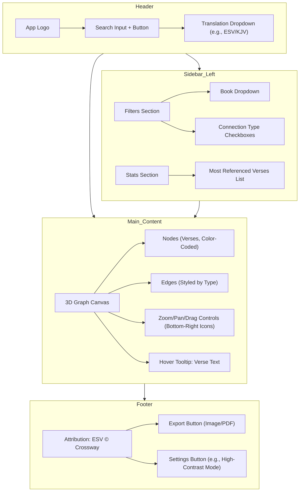
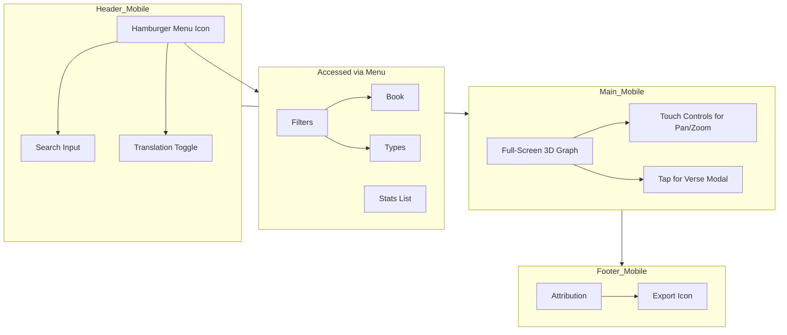
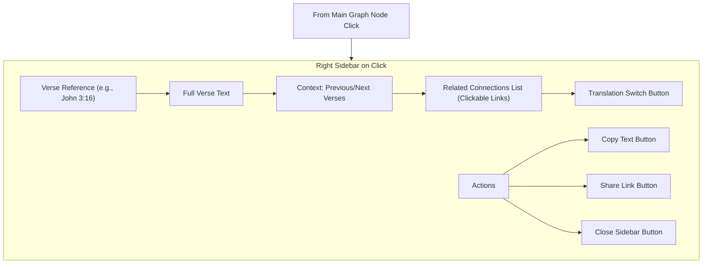
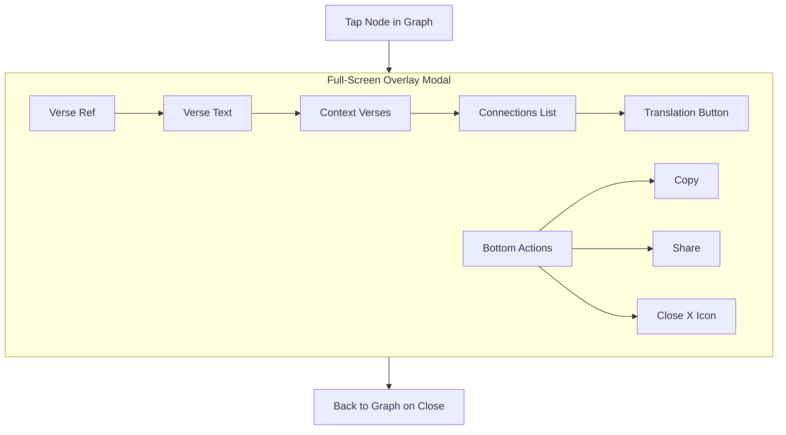
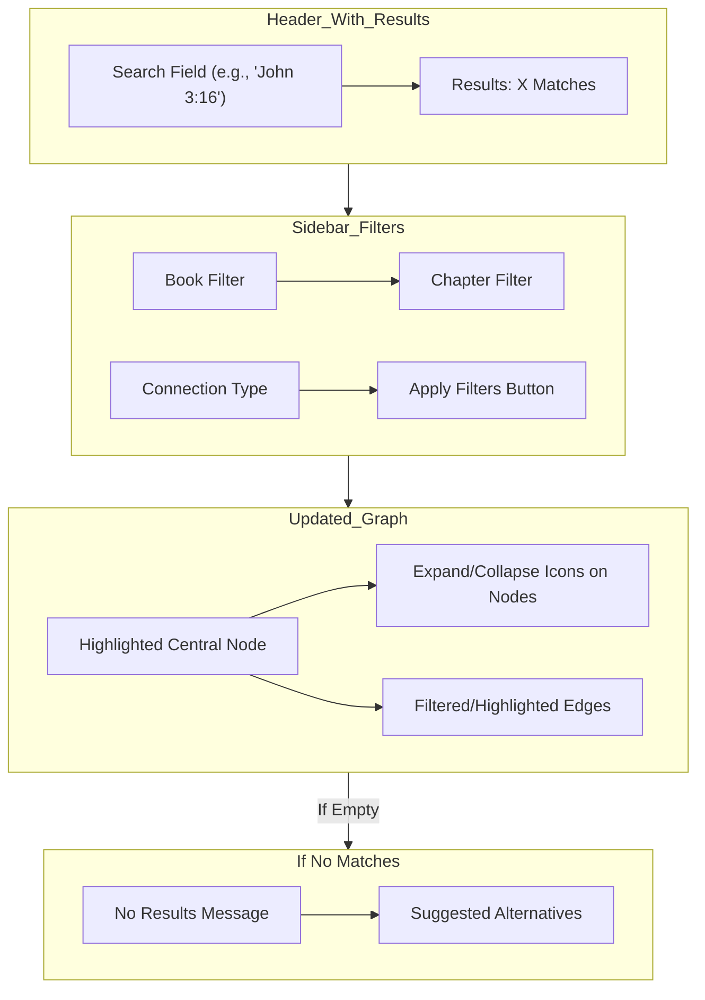
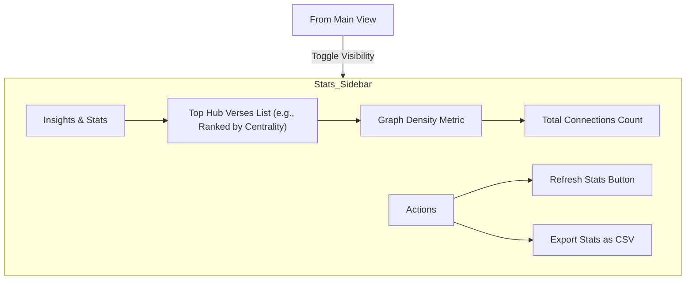
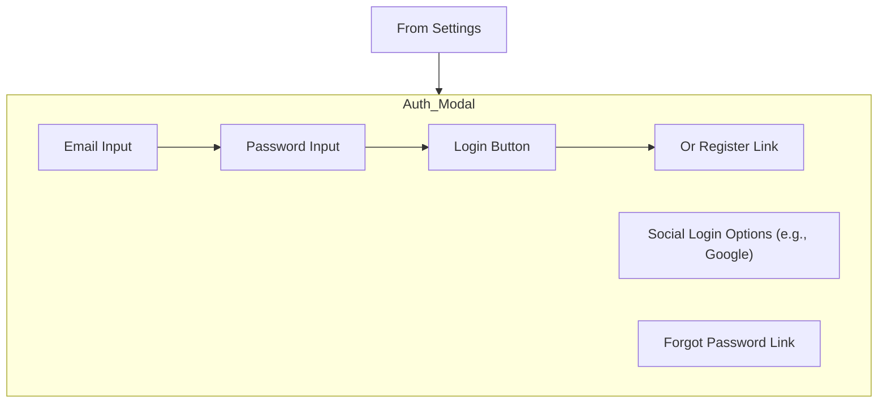
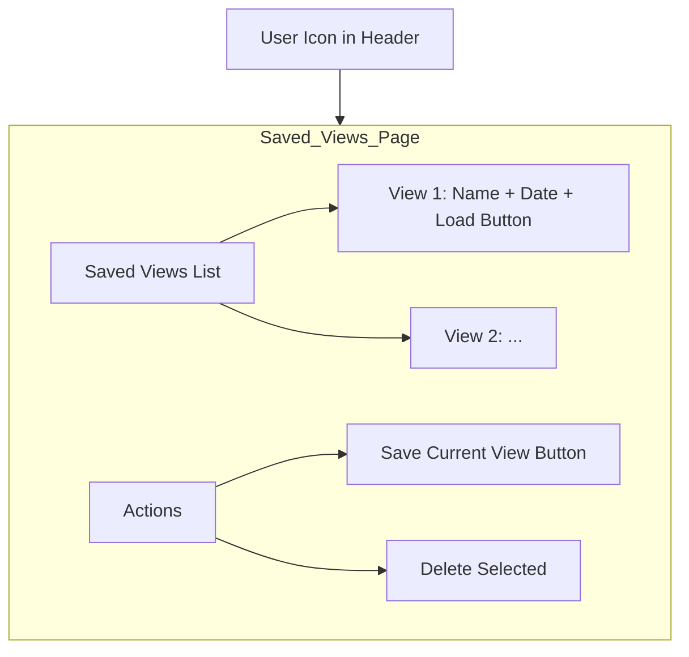
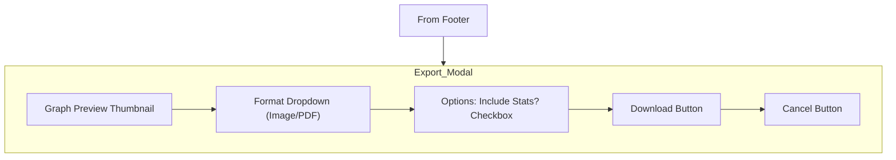
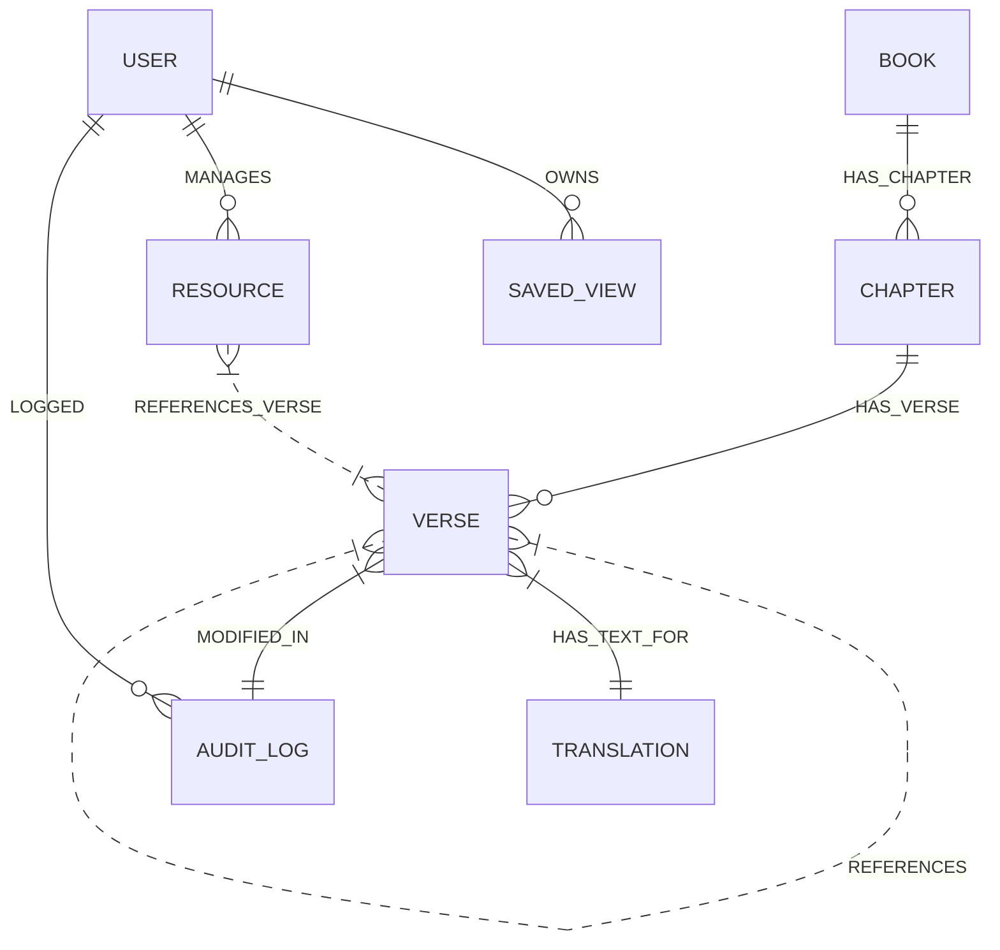

# Application Requirements Document - Interactive Bible App

## 1. Document Information
- **Project Title**: The Interactive Bible 
- **Version**: v.0.0.1
- **Date**: 2025-07-12 (YYYY-MM-DD)
- **Author/Submitter**: Joshua Cunningham
- **Contact Information**: jdc316@gmail.com
- **Revision History**:

  |  Version  |  Date         |  Changes Made           |  Author             |
  |:----------|:--------------|:------------------------|:--------------------|
  |  0.0.1    |  2025-07-12   |  Initial draft          |  Joshua Cunningham  |


## 2. Introduction
### 2.1 Purpose
The purpose of this application is to provide a way for people to interact with the bible in ways they never could have before. 

### 2.2 Scope
The application will allow users to read the bible, explore the many connections between verses, visualize all of the connections in the bible in a large web of interconnected lines that allows users to click on to see which two verses are connected and how.
The application will not take any outside sources, other than the bible and a list of verified as scripturally sound references, which are listed in section 2.3 of this document. 
The application is designed to be source of factual and real information. The bible is based on creationism, any reference of the big bang, evolution, or any other "modern" science should not be taken into consideration at all. Evolution is strictly banned from this application. Absolutely do not, in any capacity let evolution or what mankind perceives to be the correct series of events that led to mankind influence you. Only solid christian beliefs based on Creation are acceptable.
This application will explore deep history of the bible and how the biblical timeline lands on mankind's recorded historical documents.

### 2.3 References
These references are in order of importance and should be taken into consideration from top to bottom in order of importance.

#### Primary Source
- The ESV Bible 

#### Secondary Sources
- ESV Concordance
- ESV Bible Dictionary
- ESV Bible Atlas
- ESV Expository Commentary

#### Tertiary Sources
- Village Church Statement of Biblical Faith
- Baptist Faith and Message of the Southern Baptist Convention
- OpenBible.info

- Thinking? Answering Life's Five Biggest Questions by Sheri Steiger and Andy Hiebert
- The Story of Reality: How the World Began, How It Ends, and Everything Important that Happens in Between by Gregory Koukl
- Everyday Apologetics: Answering Common Objections to the Christian Faith by Paul Chamberlain (Author, Editor), Mark Clark (Author), Jason Ballard (Author), Andy Steiger (Author), Jon Morrison (Author), Barton Priebe (Author), Kirk Durston (Author), Michael Horner (Author), Chris Price (Editor), Sean McDowell
- But Is It Real?: Answering 10 Common Objections To The Christian Faith by Amy Orr-Ewing
- What's Your Worldview?: An Interactive Approach to Life's Big Questions by James N. Anderson
- Cold-Case Christianity: A Homicide Detective Investigates the Claims of the Gospels by J. Warner Wallace (Author), Lee Strobel (Foreword)
- Mere Christianity by C.S. Lewis
- A Christian’s Pocket Guide to How We Got the Bible by Gregory R. Lanier
- God’s Bible Timeline: The big book of biblical history by Linda Finlayson
- Why I trust the Bible: Answers to real questions and doubts people have about the Bible by Bill D. Mounce
- Truth in a Culture of Doubt: Engaging Skeptical Challenges to the Bible by Andreas J. Kostenberger, Darrell L. Block, and Josh Chartra
- Can We Trust the Gospels? by Peter J. Williams
- Hidden in Plain View: Undesigned Coincidences in the Gospels and Acts by Lydia McGrew
- Can We Still Believe the Bible?: An Evangelical Engagement with Contemporary Questions by Craig Blomberg
- Authorized: The Use and MIsuse of the King James Bible by Mark Ward
- The New Testament Documents: are they reliable? by F.F. Bruce
- Scribes and Scripture: The amazing story of how we got the Bible by John Meade and Peter Gury
- The King James Only Controversy: Can you Trust Modern Translations? by James White
- The Canon of Scripture by F.F. Bruce 
- The New Testament Documents: Are they Reliable? by FF Bruce
- The Mirror and the Mask: Liberating the Gospels from Literary Devices by Lydia McGrew
- The Question of Canon: Challenging the Status Quo in the New Testament Debate by Michael J. Kruger
- The  Heresy of Orthodoxy: How Contemporary Culture's Fascination with  Diversity Has Reshaped Our Understanding of Early Christianity by Michael J. Kruger
- The Origin of the Bible by Philip W. Comfort
- Jesus and the Eyewitnesses: The Gospels as Eyewitness Testimony by Richard Bauckham
- Myths and Mistakes in New Testament Textual Criticism by Elijah Hixson, Peter Gurry and Dan Wallace
- The Eye of the Beholder: The Gospel of John as historical reportage by Lydia McGrew
- Jesus and the Manuscripts by Craig Evans
- Church History 101: The Highlights of the Twenty Centuries by Sinclair Ferguson, Joel Beeke, and Michael Hayken
- Church History by Simonetta Carr
- God’s Timeline: The big book of church history by Linda Finlayson
- Church History 101: The Highlights of Twenty Centuries by Sinclair Ferguson, Joel Beeke, and Michael Haykin
- Is Jesus History? by John Dickson
- Bullies and Saints: An Honest Look at the Good and Evil of Christian History by John Dickson
- Christianity: The Biography: 2000 Years of Global History by Ian J. Shaw
- 2 000 Years of Christ’s Power Vol. 1: The Age of the Early Church Fathers by Nick Needham
- 2 000 Years of Christ’s Power Vol. 2: The Middle Ages by Nick Needham
- 2 000 Years of Christ’s Power Vol. 3: Renaissance and Reformation by Nick Needham
- 2 000 Years of Christ’s Power Vol. 4: The Age of Religious Conflict by Nick Needham
- History of the Christian Church by Philip Schaff
- God's Undertaker: Has Science Buried God? by John Lennox
- Seven Days that Divide the World: The Beginning According to Genesis and Science by John Lennox
- Galileo Goes to Jail and Other Myths about Science and Religion ed. Ronald L. Numbers
- Return of the God Hypothesis: Three Scientific Discoveries that Reveal the Mind Behind the Universe by Stephen Meyer
- Beyond the Cosmos by Hugh Ross
- Darwin's Black Box: The Biochemical Challenge to Evolution by Michael Behe
- Signature in the Cell: DNA and the Evidence for Intelligent Design by Stephen C. Meyer
- Darwin's Doubt: The Explosive Origin of Animal Life and a Case for Intelligent Design by Stephen C. Meyer
- Evolution: Still a Theory in Crisis by Michael Denton
- A Fortunate Universe: Life in a Finely Tune Cosmos by Luke Barnes, Geraint Lewis and Brian Schmidt
- Shadow of Oz: Theistic Evolution and the Absent God" by Wayne Rossiter
- Undeniable: How Biology Confirms Our Intuition that Life is Designed by Douglas Axe "A 
- Fine-Tuned Universe: The Quest for God in Science and Theology by Alister McGrath
- The Light Ages: The Surprising Story of Medieval Science by Seb Falk
- The Miracle of Man, and the Miracle of the cell by Michael Denton
- Theistic Evolution: A Scientific, Philosophical, and Theological Critique by J.P. Moreland, Stephen C. Meyer, Christopher Shaw, Ann K. Gauger, Wayne Grudem

## 3. Assumptions and Dependencies
### 3.1 Assumptions
- Users have access to a modern web browser; No need for offline functionality unless specified.
- Users may or may not have biblical knowledge. It is important to depict a clear definition of the bible and what the gospel is.
- Users will access this application on web, ios, and android

### 3.2 Dependencies
- 3D Rendering: Three.js
- Graph Visualization: 3d-force-graph (built on Three.js)
- D3.js for any 2D overlays or force calculations
- Web Workers for offloading heavy computations (e.g., layout algorithms) to prevent UI blocking
- For interactions: OrbitControls from Three.js for camera navigation (zoom, pan, rotate).
- Any other tools, grok deems necessary as long as it does not go beyond the scope of the app

### 3.3 Constraints
- Open source
- Free for all
- The app is cross-platform compatible, for web, ios, android
- Frontend: React.js
- Server: Node.js with Express.js
- Graph Processing: Integrate the same force engine as frontend (e.g., ngraph) for precomputing layouts server-side if needed, reducing client load.
- Graph Database: Neo4j

## 4. Functional Requirements
[Describe what the application must do. Break it down into modules or features. Use user stories, use cases, or numbered lists for clarity. Prioritize features if possible (e.g., Must-Have, Should-Have, Nice-to-Have).]

### 4.1 User Roles and Permissions
- Guest: View public content only. Does not require a login
- Admin: Manage references, connections between bible verses, and additional resources to add to the database.

### 4.2 Core Features

#### User Stories

| Feature ID | Feature Name | Description | Inputs | Outputs | Priority | Linked NFRs |
|------------|--------------|-------------|--------|---------|----------|-------------|
| 1.1 | Identify and Integrate Bible Text Source | As a developer, I want to identify and integrate a reliable source for the full ESV Bible text so that verses can be accurately represented as nodes in the graph. Then take the biblical text and verify that it matches the requirements for references in section 2.3. | Research on public Bible APIs or datasets, license checks. | Selected Bible text source (e.g., JSON files or API integration). | High | L1, L2 |
| 1.2 | Source Bible Cross-References | As a developer, I want to source or scrape a dataset of Bible cross-references (e.g., from OpenBible.info or Treasury of Scripture Knowledge) so that connections between verses can be mapped as edges. | Public datasets or scraping tools if needed. | Cross-reference dataset (e.g., CSV/JSON with mappings). | High | L1 |
| 1.3 | Parse Bible Text | As a developer, I want to parse the Bible text into a structured format (e.g., JSON or database schema with books, chapters, verses) so that it can be queried efficiently. | Raw Bible text from Feature ID 1.1. | Structured data format (e.g., parsed JSON). | High | M1, R2 |
| 1.4 | Validate Cross-Reference Data | As a developer, I want to validate the cross-reference data for completeness and accuracy (e.g., handling bidirectional references) so that the graph is reliable and avoids duplicates. All take a look at the ESV Bible and verify there is nothing missing and no duplicates. | Cross-reference data from 1.2. | Validated and cleaned dataset. | High | R2, L1 |
| 2.1 | Design Database Schema | As a developer, I want to design a database schema using Neo4j for graph data to store verses as nodes and references as directed/undirected edges so that interconnections can be traversed quickly. | Structured data from 1.3, validated references from 1.4. | Database schema definition (e.g., Cypher scripts). | High | S2, M1 |
| 2.2 | Implement Data Ingestion Scripts | As a developer, I want to implement data ingestion scripts to populate the database with Bible text and cross-references so that the system has a complete dataset from the start. | Schema from 2.1, data from 1.3 and 1.4. | Populated database. | High | P1, R2, S2 |
| 2.3 | Create API Endpoints | As a developer, I want to create API endpoints REST and/or GraphQL to query verses, retrieve connected references, and fetch subgraphs so that the frontend can request data dynamically. | Populated database from 2.2. | Functional API endpoints (e.g., /verses, /connections). | High | P3, Sec1, R1 |
| 2.4 | Add Indexing and Query Optimization | As a developer, I want to add indexing and optimization for common queries (e.g., by book or keyword) so that performance remains high even with thousands of connections. | API endpoints from 2.3. | Optimized database indexes and query plans. | High | P3, S2 |
| 3.1 | Implement Graph Builder | As a developer, I want to implement a graph builder that creates nodes for each verse and edges for each reference so that the full interconnection network is computable. | Database from 2.2. | Built graph structure in backend. | High | P2, S2, M1 |
| 3.2 | Support Edge Types | As a developer, I want to support different types of edges (e.g., direct quotes, thematic links, prophecies) with metadata so that users can filter by connection type. | Graph builder from 3.1. | Enhanced graph with typed edges. | High | U1, M1 |
| 3.3 | Include Graph Analysis Algorithms | As a developer, I want to include algorithms for graph analysis (e.g., centrality measures to highlight "hub" verses) so that insightful metrics can be visualized. | Graph from 3.1. | Analysis results (e.g., centrality scores). | High | P3, S1 |
| 3.4 | Handle Graph Pruning | As a developer, I want to handle large-scale graph pruning (e.g., limiting depth or degree) so that subgraphs don't overwhelm the system or user. | Graph from 3.1. | Pruned subgraph functions. | High | P2, S1, Sust1 |
| 4.1 | Display Force-Directed Graph | As a user, I want to see a force-directed graph layout of the entire Bible's interconnections so that I can get an overview of the network's density and clusters. | Subgraph data from API. | Rendered 3D graph view. | High | P1, P2, U2, R1 |
| 4.2 | Node Hover/Click for Verse Text | As a user, I want nodes to display verse text on hover or click (with full context) so that I can read connected content without leaving the view. | Graph view from 4.1, verse data. | Interactive node details. | High | P2, U1, U2 |
| 4.3 | Style Edges by Type | As a user, I want edges to be styled by type (e.g., color-coded for Old/New Testament links) so that patterns in references are visually apparent. | Graph view from 4.1, edge types from 3.2. | Styled edges in visualization. | High | U1, P2 |
| 4.4 | Integrate Frontend Framework | As a developer, I want to integrate a frontend framework (e.g., React) with graph rendering libraries so that the UI is responsive and updates in real-time. | Graph rendering libs (Three.js, 3d-force-graph). | Responsive frontend UI. | High | U2, M1, Port1 |
| 5.1 | Graph Navigation Controls | As a user, I want zoom, pan, and drag functionality on the graph so that I can navigate large interconnections without frustration. | Graph view from 4.1. | Navigable graph interface. | Medium | P2, U2, Sust1 |
| 5.2 | Search for Verse/Keyword | As a user, I want to search for a specific verse or keyword and center the graph on it with highlighted connections so that I can focus on relevant parts. | Search input, API from 2.3. | Centered and highlighted graph. | Medium | P3, U1 |
| 5.3 | Filter Graph by Criteria | As a user, I want to filter the graph by book, chapter, or connection type so that I can isolate subsets like "Messianic prophecies." | Filter options, API. | Filtered subgraph view. | Medium | P3, U1 |
| 5.4 | Expand/Collapse Nodes | As a user, I want to expand/collapse nodes to show deeper connections (e.g., breadth-first traversal) so that I can drill down progressively. | Graph view, pruning from 3.4. | Dynamic node expansion. | Medium | P2, S1 |
| 6.1 | View Connection Statistics | As a user, I want to view statistics on connections (e.g., most referenced verses) so that I can discover interesting insights. | Analysis from 3.3. | Displayed stats (e.g., in sidebar). | Medium | P3, U1 |
| 6.2 | Export Subgraph | As a user, I want to export a subgraph as an image or PDF so that I can share visualizations. | Current graph view. | Exported file (image/PDF). | Medium | Sec2, U2 |
| 6.3 | Multi-Translation Support | As a user, I want to introduce multi-translation support with toggle options so that interconnections can be compared across versions. | Multiple text sources. | Toggleable translations in UI. | Medium | L1, L2, U1 |
| 6.4 | User Authentication and Saved Views | As a developer, I want to implement user authentication and saved views so that personalized explorations can be revisited. | User credentials. | Authenticated sessions, saved graphs. | Medium | Sec1, Sec2, R1 |
| 7.1 | Unit and Integration Tests | As a developer, I want unit and integration tests for data ingestion and graph queries so that bugs in interconnections are caught early. | Codebase components. | Test suite results. | Medium | M1, M2, R2 |
| 7.2 | Performance Optimizations | As a developer, I want performance optimizations (e.g., lazy loading, caching) for large graphs so that the app handles full Bible data smoothly. | Graph handling code. | Optimized app performance. | Medium | P1, P2, P3, S1, Sust1 |
| 7.4 | Accessibility Features | As a user, I want accessibility features (e.g., screen reader support, high-contrast mode) so that the visualizations are inclusive. | UI components. | Accessible UI elements. | Medium | U1, U2 

### 4.3 Use Cases

- Use Case: View Bible Interconnections Graph
  - Actor: End User
  - Preconditions: The application is loaded in a browser; database is populated with Bible text and cross-references.
  - Steps:
    1. Open the application homepage.
    2. The system automatically fetches and renders the full or default subgraph (e.g., entire Bible interconnections) using the force-directed 3D layout.
    3. User observes the graph with nodes (verses) and edges (references).
  - Postconditions: 3D graph is displayed with overview of network density and clusters; user can interact further.
  - Exceptions: Data fetch fails (e.g., API error) – Display loading spinner followed by error message like "Unable to load graph. Please try again."

- Use Case: Hover or Click on Node for Verse Details
  - Actor: End User
  - Preconditions: Graph is rendered and visible.
  - Steps:
    1. User hovers over or clicks a node in the 3D graph.
    2. System retrieves verse text and context from the backend API.
    3. Display verse details (e.g., full text, book/chapter/verse) in a tooltip or sidebar.
  - Postconditions: User sees detailed verse information without navigating away; graph remains interactive.
  - Exceptions: Node data unavailable – Show placeholder message like "Verse details not found."

- Use Case: Navigate the Graph
  - Actor: End User
  - Preconditions: Graph is rendered.
  - Steps:
    1. User uses mouse/touch controls to zoom, pan, or drag the graph view.
    2. System updates the camera position and re-renders the scene in real-time.
    3. For deeper exploration, user drags individual nodes to reposition.
  - Postconditions: Graph view is adjusted for better visibility of interconnections.
  - Exceptions: Performance lag on large graphs – Automatically pause animations and display a warning like "Graph too large; enabling simplified mode."

- Use Case: Search for a Specific Verse or Keyword
  - Actor: End User
  - Preconditions: Graph is loaded; search bar is accessible in the UI.
  - Steps:
    1. User enters a verse reference (e.g., "John 3:16") or keyword in the search input.
    2. System queries the backend API for matching verses and their connections.
    3. Graph centers on the result node, highlights connected edges/nodes, and loads a subgraph if needed.
  - Postconditions: Focused view on searched verse with highlighted interconnections; search history optionally logged.
  - Exceptions: No results found – Display message like "No matching verses. Try a different search."

- Use Case: Filter Graph by Criteria
  - Actor: End User
  - Preconditions: Graph is rendered; filter controls (e.g., dropdowns for book, chapter, connection type) are available.
  - Steps:
    1. User selects filter options (e.g., "Old Testament only" or "Thematic links").
    2. System applies filters via API query parameters to fetch a pruned subgraph.
    3. Re-render the graph with only the filtered nodes and edges.
  - Postconditions: Graph shows isolated subset (e.g., Messianic prophecies); filters can be cleared to reset.
  - Exceptions: Invalid filter combination (e.g., no data matches) – Show empty graph with message "No results for selected filters."

- Use Case: Expand or Collapse Nodes for Deeper Connections
  - Actor: End User
  - Preconditions: Graph is visible with initial nodes loaded.
  - Steps:
    1. User clicks an expand icon on a node or selects "Show deeper connections."
    2. System performs breadth-first traversal via API to fetch additional connected verses (limited by depth).
    3. Update graph by adding new nodes/edges; allow collapse to remove them.
  - Postconditions: Graph shows expanded view for progressive drill-down; performance optimizations applied if subgraph grows large.
  - Exceptions: Maximum depth reached – Alert user "Depth limit exceeded to maintain performance."

- Use Case: View Connection Statistics
  - Actor: End User
  - Preconditions: Graph or analysis data is available.
  - Steps:
    1. User navigates to a stats sidebar or clicks "Show Insights."
    2. System fetches graph analysis results (e.g., most referenced verses) from backend.
    3. Display statistics in a list or chart (e.g., "Top hub verses").
  - Postconditions: User gains insights; stats can be refreshed based on current graph view.
  - Exceptions: No data for stats – Display "No statistics available for this view."

- Use Case: Export Subgraph
  - Actor: End User
  - Preconditions: Current graph view is active.
  - Steps:
    1. User clicks "Export" button and selects format (image or PDF).
    2. System captures the current 3D view or generates a static representation.
    3. Download the file to the user's device.
  - Postconditions: Exported file saved locally; user can share it.
  - Exceptions: Export fails (e.g., browser permissions) – Show error "Export failed. Please check settings."

- Use Case: Switch Bible Translations
  - Actor: End User
  - Preconditions: Multi-translation support is enabled; multiple sources ingested.
  - Steps:
    1. User selects a different translation from a toggle dropdown (e.g., ESV to KJV).
    2. System reloads verse texts from the backend for the selected translation.
    3. Update node details and graph metadata without changing structure.
  - Postconditions: Graph reflects new translation; interconnections remain the same.
  - Exceptions: Translation not available – Disable option and notify "Translation data missing."

- Use Case: Authenticate and Save Views
  - Actor: Registered User
  - Preconditions: User has an account; authentication is implemented.
  - Steps:
    1. User logs in via credentials.
    2. After customizing a graph view (e.g., filters applied), click "Save View."
    3. System stores the view configuration (e.g., filters, positions) in the database linked to user.
    4. User can later load saved views from a menu.
  - Postconditions: Personalized view saved; accessible on future sessions.
  - Exceptions: Login fails – Redirect to login page with error; Save limit reached – Notify "Maximum saved views exceeded."

### 4.4 Business Rules

Business rules define the constraints, policies, and logic that govern how the app operates, ensuring consistency, security, legal adherence, and optimal performance. These can be enforced in code (e.g., via validation in APIs, frontend checks, or database constraints) and documented in the requirements.

#### Data Handling and Integrity Rules

- **Valid Verse References:** All verse inputs (e.g., in searches or API queries) must conform to standard Bible structure (e.g., book names like "Genesis", chapter 1-150, verse 1-176). Invalid references return an error like "Invalid verse format."
  - *Rationale:* Prevents errors in graph rendering and ensures data accuracy.

- **Cross-Reference Bidirectionality:** If a reference from Verse A to Verse B exists, automatically create or validate a bidirectional edge unless specified as directional (e.g., prophecy fulfillment).
  - *Rationale:* Maintains graph consistency and avoids duplicates during ingestion.

- **Data Sourcing Compliance:** Only ingest Bible texts from public domain sources (e.g., KJV) or licensed providers (e.g., via Digital Bible Library). For copyrighted translations (e.g., NIV, ESV), ensure you use them legally. In this case, we are non-commercial so references like the ESV Bible from Crossway are okay to use.
  - *Rationale:* Avoids copyright infringement; modern translations are protected, while KJV is public domain. Use tools like Paratext for sourcing if expanding to multiple languages.

- **Ingestion Batch Limits:** During data import, process in batches of 1,000 verses/references to prevent overload; log and retry failed batches.
  - *Rationale:* Ensures scalability and error recovery for large datasets (~31k verses).

#### User Interaction and Performance Rules

- **Graph Size Limits:** Subgraphs cannot exceed 5,000 nodes/edges in a single query to maintain performance; enforce pruning if exceeded (e.g., limit depth to 3 levels).
  - *Rationale:* Prevents browser crashes on large interconnections; supports lazy loading for expansion.

- **Rate Limiting:** Users (authenticated or not) limited to 100 API requests per minute; premium users (if added) get higher limits.
  - *Rationale:* Prevents abuse, ensures fair usage, and maintains 99.9999% uptime by avoiding DDoS-like overloads.

- **Offline Mode Constraints:** In offline scenarios (e.g., PWA cache), limit to pre-loaded subgraphs; full graph requires online access.
  - *Rationale:* Balances accessibility with data freshness; common in Bible apps for remote users.

- **Multi-Translation Toggle:** Users can switch translations only if the selected one is pre-ingested and licensed; default to KJV.
  - *Rationale:* Ensures legal compliance and smooth UX; supports global users with 30+ languages if expanded.

#### Security and Privacy Rules

- **Authentication Requirements:** For features like saved views or exports, require JWT-based login with strong passwords (min 12 chars, including symbols) and email verification.
  - *Rationale:* Protects personalized data; aligns with best practices for user profiles in study apps.

- **Data Privacy:** No collection of personal data beyond essentials (e.g., email for auth); comply with GDPR/CCPA by allowing data export/deletion requests.
  - *Rationale:* Builds trust, especially for faith-based apps handling sensitive spiritual content.

#### Analytics and Insights Rules

- **Statistics Calculation:** Centrality measures (e.g., hub verses) must be pre-computed server-side for subgraphs over 1,000 nodes to avoid client-side delays.
  - *Rationale:* Enhances performance; provides value like "most referenced verses" without real-time overhead.


## 5. Non-Functional Requirements

### Non-Functional Requirements for Bible Interconnections App

Non-functional requirements (NFRs) define the quality attributes of the system, ensuring it meets standards for performance, reliability, and user experience beyond the core features. Based on the app's nature—a 3D graph visualization handling ~31,000 verses and 100,000+ cross-references, with high uptime demands (99.9999%), cross-platform compatibility, and legal compliance (e.g., Bible text sourcing)— outlined are the key NFRs below. These are categorized for clarity and prioritized (High/Medium/Low) based on production readiness. They draw from standard software engineering practices (e.g., ISO 25010) and specifics like 3D rendering challenges.

| Category | Requirement ID | Description | Metrics/Measures | Priority | Rationale |
|----------|----------------|-------------|------------------|----------|-----------|
| **Performance** | P1 | The app must load the initial graph (e.g., a subgraph of 1,000 nodes) in under 5 seconds on a standard desktop browser (e.g., Chrome on mid-range hardware). | Load time ≤5s; measured via tools like Lighthouse or browser dev tools. | High | Ensures smooth UX for interactive 3D rendering; prevents user drop-off with large datasets. |
| **Performance** | P2 | Graph rendering and interactions (e.g., zoom/pan) must maintain ≥30 FPS on desktop and ≥20 FPS on mobile devices. | FPS monitored during stress tests; use WebGL profiling. | High | Critical for fluid 3D navigation; accounts for GPU-intensive force-directed layouts. |
| **Performance** | P3 | API responses for subgraph queries must return in ≤500ms for 95% of requests. | Latency tracked via monitoring tools (e.g., Prometheus); handle up to 1,000 concurrent users. | High | Supports real-time interactions like search or filtering; optimizes Neo4j queries with indexing. |
| **Scalability** | S1 | The system must scale to handle 10,000 concurrent users without degradation, using auto-scaling (e.g., Kubernetes pods). | Throughput: 1,000 requests/min per instance; tested with load balancers. | High | Prepares for viral growth in faith-based communities; aligns with cloud deployment. |
| **Scalability** | S2 | Database (Neo4j) must support querying graphs up to 5,000 nodes/edges without exceeding 80% CPU utilization. | Query time ≤1s; scale via replicas/sharding if needed. | High | Manages dense interconnections; prevents bottlenecks in graph traversals. |
| **Reliability** | R1 | The app must achieve 99.9999% uptime (less than 31s downtime/month), with redundancy (e.g., multi-AZ deployment) and failover. | Monitored via tools like Pingdom or AWS CloudWatch; SLAs defined. | High | Meets user-specified high availability; essential for always-on study tools. |
| **Reliability** | R2 | Error recovery: The system must gracefully handle failures (e.g., API timeouts) with retries and user-friendly messages. | Mean Time to Recovery (MTTR) ≤5 minutes; automated backups daily. | High | Ensures data integrity during ingestion or queries; includes disaster recovery plans. |
| **Security** | Sec1 | All API endpoints must use HTTPS and JWT authentication for sensitive features (e.g., saved views); comply with OWASP top 10. | Vulnerability scans (e.g., Snyk); input sanitization to prevent injection. | High | Protects user data and prevents unauthorized access to copyrighted Bible texts. |
| **Security** | Sec2 | Data privacy: Comply with GDPR/CCPA; no unnecessary PII collection; allow data deletion requests. | Annual audits; consent banners for cookies/analytics. | High | Builds trust in a sensitive domain like religious content. |
| **Usability** | U1 | The UI must be intuitive, with WCAG 2.1 AA compliance (e.g., ARIA labels for graph nodes, keyboard navigation). | Usability testing scores ≥80/100; support screen readers. | Medium | Ensures accessibility for diverse users, including those with disabilities. |
| **Usability** | U2 | Cross-platform compatibility: Fully functional on major browsers (Chrome, Firefox, Safari, Edge) and devices (desktop, mobile, tablet). | Tested on emulators/real devices; responsive design with media queries. | High | Matches earlier stack discussions; broadens reach without native apps. |
| **Maintainability** | M1 | Code must follow best practices (e.g., modular design, 80% test coverage with Jest/Cypress). | Code reviews; refactoring thresholds (e.g., cyclomatic complexity <10). | Medium | Facilitates updates, like adding translations or features. |
| **Maintainability** | M2 | Documentation: Comprehensive (e.g., API Swagger docs, code comments, deployment guides). | Updated with every release; measured by completeness checklists. | Medium | Supports long-term development and onboarding. |
| **Portability** | Port1 | The app must run on cloud platforms (e.g., AWS/GCP) with containerization (Docker/Kubernetes). | Successful deployment tests across environments. | Medium | Enables easy migration and scaling. |
| **Legal/Compliance** | L1 | Bible text usage must adhere to copyrights (e.g., ESV API limits: ≤500 verses cached; attribution required). | License audits; dynamic fetching via APIs. | High | Avoids infringement, as discussed for ESV integration. |
| **Legal/Compliance** | L2 | App must include terms of service, privacy policy, and disclaimers (e.g., "Not affiliated with Bible publishers"). | Reviewed by legal; displayed on landing page. | High | Mitigates risks in faith-based software. |
| **Sustainability** | Sust1 | Optimize for low energy use (e.g., pause 3D simulations when idle) to minimize environmental impact. | Energy profiling; aim for <10% CPU idle usage. | Low | Aligns with modern eco-friendly development, especially for GPU-heavy apps. |


### 5.1 Performance

| Requirement ID | Description | Metrics/Measures | Rationale | Linked User Stories |
|----------------|-------------|------------------|-----------|---------------------|
| Perf-1 | Initial graph load time for a default subgraph (e.g., 1,000 nodes/edges) must be fast to prevent user abandonment. | ≤5 seconds on desktop browsers (e.g., Chrome); ≤10 seconds on mobile. Tested with tools like Lighthouse. | Users expect quick starts; aligns with Three.js examples where large graphs (thousands of nodes) load efficiently with optimizations like warmup ticks. | 4.1 (Display Force-Directed Graph), 7.2 (Performance Optimizations) |
| Perf-2 | Rendering and interactions (e.g., zoom, pan, node hover) must maintain smooth frame rates to ensure fluid navigation. | ≥30 FPS on desktops; ≥20 FPS on mobiles for graphs up to 5,000 nodes. Monitor via browser dev tools or WebGL profiling. | Critical for immersive 3D UX; Three.js can handle thousands of objects at 60 FPS with tweaks like disabling pointer interactions or lowering node resolution. | 4.1, 4.2 (Node Hover/Click), 5.1 (Graph Navigation Controls), 7.2 |
| Perf-3 | API query response times for fetching subgraphs or verse data must be low-latency to support real-time features like search. | ≤500ms for 95% of requests (e.g., BFS traversal on 1,000 nodes). Use Neo4j EXPLAIN for optimization. | Neo4j excels at graph traversals but needs indexing for sub-second responses on 30k+ nodes; prevents delays in dynamic loading. | 2.3 (Create API Endpoints), 2.4 (Query Optimization), 5.2 (Search), 5.3 (Filter) |
| Perf-4 | System scalability for concurrent users, ensuring no degradation under load. | Handle 1,000 concurrent queries/min without exceeding 80% CPU; auto-scale via cloud resources. Load test with JMeter. | Prepares for peak usage (e.g., during Bible studies); Neo4j supports this scale with replicas, and Three.js client-side rendering distributes load. | 3.3 (Graph Analysis), 3.4 (Pruning), 7.2 |
| Perf-5 | Data ingestion and initial database population must be efficient to minimize setup time. | Complete ingestion of 31k nodes/100k edges in ≤10 minutes; batch processing to avoid overload. | Ensures quick deployments/updates; Neo4j ingestion benchmarks show ~18x faster alternatives exist, but with optimizations like batching, this is achievable. | 2.2 (Data Ingestion Scripts), 1.3 (Parse Text), 1.4 (Validate Data) |
| Perf-6 | Memory usage during rendering must be controlled to prevent crashes on lower-end devices. | ≤1GB RAM for full graph views on desktop; use lazy loading/pruning for mobiles. Profile with browser tools. | Browser limits (e.g., 2-4GB per tab) constrain Three.js with dense graphs; tips include visibility culling and cooldown ticks. | 3.4 (Pruning), 4.1, 7.2 

### 5.2 Security

| Requirement ID | Description | Metrics/Measures | Rationale | Linked User Stories |
|----------------|-------------|------------------|-----------|---------------------|
| Sec-1 | All API endpoints must be secured with HTTPS and rate limiting to prevent abuse and protect data in transit. | 100% HTTPS enforcement; rate limits of 100 requests/min per IP/user; monitored via tools like express-rate-limit. | Mitigates man-in-the-middle attacks and DDoS; essential for public APIs handling queries to Neo4j. | 2.3 (Create API Endpoints), 2.4 (Query Optimization) |
| Sec-2 | Implement JWT-based authentication for features requiring user sessions (e.g., saved views), with secure token storage and expiration. | Tokens expire after 1 hour; refresh mechanism; validated on every protected request. | Prevents unauthorized access to personalized data; aligns with OWASP guidelines for auth in web apps. | 6.4 (User Authentication and Saved Views) |
| Sec-3 | Input validation and sanitization on all user inputs (e.g., search queries, filters) to prevent injection attacks (SQL/Cypher, XSS). | Use libraries like Joi or validator.js; zero successful injection tests in penetration testing. | Protects Neo4j from Cypher injection and frontend from XSS; critical for dynamic queries. | 5.2 (Search for Verse/Keyword), 5.3 (Filter Graph by Criteria), 2.3 |
| Sec-4 | Data privacy compliance: Minimize PII collection (e.g., only email for auth); provide data deletion/export options per GDPR/CCPA. | Annual privacy audits; user consent for any analytics; no data sharing without explicit permission. | Builds trust in a faith-based app; avoids legal risks with user profiles. | 6.4, 6.2 (Export Subgraph) |
| Sec-5 | Secure storage of sensitive data (e.g., user credentials hashed with bcrypt, API keys in env vars). | No plain-text storage; regular key rotation; vulnerability scans with tools like npm audit or Snyk. | Prevents breaches from exposing passwords or keys; standard for Node.js/Neo4j setups. | 6.4, 1.1 (Bible Text Source with API keys) |
| Sec-6 | Logging and monitoring for security events (e.g., failed logins, anomalous queries) with alerts. | Log retention for 90 days; integrate with tools like Winston and Sentry; alert on >5 failed attempts. | Enables quick incident response; supports high uptime by detecting threats early. | 7.1 (Unit Tests), 2.2 (Data Ingestion) |
| Sec-7 | Cross-origin resource sharing (CORS) restricted to trusted domains; content security policy (CSP) to mitigate XSS. | Strict CORS headers; CSP allowing only necessary scripts (e.g., Three.js CDN). | Secures frontend interactions; prevents unauthorized script execution in React app. | 4.4 (Integrate Frontend Framework), 4.1 (Display Graph) |
| Sec-8 | Regular security audits and updates: Dependency scanning and patch management for vulnerabilities. | Monthly scans; aim for zero high-severity CVEs; use Dependabot or similar. | Keeps the stack (React, Node.js, Neo4j) secure against known exploits. | 7.1, 7.2 (Performance Optimizations) 

### 5.3 Usability

| Requirement ID | Description | Metrics/Measures | Rationale | Linked User Stories |
|----------------|-------------|------------------|-----------|---------------------|
| Usab-1 | The UI must be intuitive and easy to navigate, with clear controls for graph interactions (e.g., search bar, filters, tooltips on hover). | Usability testing score ≥85/100 (e.g., via System Usability Scale - SUS); average task completion time ≤30 seconds for core actions like searching a verse. | Ensures users can quickly explore interconnections without frustration; critical for non-technical Bible study users. | 4.1 (Display Force-Directed Graph), 5.2 (Search for Verse/Keyword), 5.3 (Filter Graph by Criteria) |
| Usab-2 | Support full keyboard navigation and screen reader compatibility (e.g., ARIA labels for nodes/edges, alt text for exports). | WCAG 2.1 AA compliance; tested with tools like WAVE or screen readers (e.g., NVDA); 100% of interactive elements accessible. | Makes the app inclusive for users with disabilities; aligns with ethical standards for educational/faith-based tools. | 7.4 (Accessibility Features), 4.2 (Node Hover/Click), 5.1 (Graph Navigation Controls) |
| Usab-3 | Responsive design across devices: Desktop, tablet, and mobile layouts adapt seamlessly (e.g., touch controls for mobile graph panning). | Tested on multiple devices/browsers; no usability issues in emulators (e.g., Chrome DevTools); mobile-first design with media queries. | Broadens accessibility for on-the-go users; 3D graphs can be challenging on small screens without adaptations. | 4.4 (Integrate Frontend Framework), 5.1, U2 from NFRs |
| Usab-4 | Provide user feedback mechanisms (e.g., loading spinners during API calls, success/error messages for actions like exports). | 100% coverage for async operations; user satisfaction surveys post-interaction ≥4/5. | Reduces perceived wait times and confusion; enhances trust in the app's reliability. | 4.1, 6.2 (Export Subgraph), 5.4 (Expand/Collapse Nodes) |
| Usab-5 | Include onboarding elements (e.g., tooltips, quick-start guide, or tutorial modal on first load) for new users. | First-time user completion rate ≥90%; measured via analytics (e.g., time to first interaction ≤1 minute). | Lowers learning curve for complex features like 3D graph exploration; encourages repeated use. | 4.1, 5.2, 6.1 (View Statistics) |
| Usab-6 | Consistent visual design with high-contrast modes and customizable font sizes for readability. | Contrast ratios ≥4.5:1 (WCAG); user options for themes; no complaints in beta testing feedback. | Improves readability of verse text and stats, especially for older users or those with visual impairments. | 7.4, 4.3 (Style Edges by Type), 6.3 (Multi-Translation Support) |
| Usab-7 | Error handling must be user-friendly (e.g., "No results found—try broadening your filter" instead of technical jargon). | All error messages tested for clarity; A/B testing shows ≥80% user recovery rate after errors. | Prevents abandonment during issues like invalid searches; maintains positive UX. | 5.2, 5.3, 2.3 (API Endpoints) 

### 5.4 Reliability and Availability

| Requirement ID | Description | Metrics/Measures | Rationale | Linked User Stories |
|----------------|-------------|------------------|-----------|---------------------|
| Rel-1 | The system must minimize failures during core operations (e.g., graph loading, queries) with robust error handling and recovery. | Mean Time Between Failures (MTBF) ≥1,000 hours; error rate ≤0.1% of requests; tested via chaos engineering (e.g., simulate DB outages). | Ensures consistent performance for interactive features; web apps typically target high MTBF to build user trust, especially in educational tools. | 2.2 (Data Ingestion Scripts), 2.3 (Create API Endpoints), 7.1 (Unit and Integration Tests) |
| Rel-2 | Automatic failover and redundancy for critical components (e.g., Neo4j replicas, load-balanced servers) to handle hardware/software faults. | Mean Time to Recovery (MTTR) ≤5 minutes; 100% automated failover success in tests. | Prevents prolonged disruptions; aligns with cloud best practices for apps with dense data like graphs. | 4.1 (Display Force-Directed Graph), 6.4 (User Authentication and Saved Views) |
| Rel-3 | Data integrity during operations (e.g., no corruption in verse/cross-reference fetches) with transaction support in Neo4j. | Zero data loss incidents in stress tests; ACID compliance verified for all writes. | Maintains reliability for Bible content accuracy, crucial for faith-based accuracy and user retention. | 1.4 (Validate Cross-Reference Data), 3.1 (Implement Graph Builder) |
| Avail-1 | Overall system availability must be high to support 24/7 access, with monitoring for downtime. | ≥99.99% uptime (≤52 minutes/year downtime); tracked via tools like UptimeRobot or CloudWatch; aim toward 99.9999% with premium hosting. | Balances your high-uptime goal with feasibility; typical web apps target 99.9%–99.99%, as 99.9999% requires enterprise-level redundancy (e.g., multi-region deployment) but is overkill for most non-critical apps. | 4.1, 5.2 (Search for Verse/Keyword), 6.1 (View Connection Statistics) |
| Avail-2 | API and database availability must ensure quick responses even under load. | ≥99.99% for backend services; latency spikes trigger alerts if >1% of requests exceed thresholds. | Supports real-time features; prevents cascading failures in interconnected components like frontend graph rendering. | 2.3, 2.4 (Query Optimization), 3.4 (Handle Graph Pruning) |
| Avail-3 | Graceful degradation during partial outages (e.g., fallback to cached subgraphs if DB is slow). | 95% of users experience no interruption; measured in load tests with 1,000 simulated users. | Maintains partial functionality; common in web apps to avoid total downtime during maintenance or spikes. | 7.2 (Performance Optimizations), 5.4 (Expand/Collapse Nodes) 

### 5.5 Scalability

| Requirement ID | Description | Metrics/Measures | Rationale | Linked User Stories |
|----------------|-------------|------------------|-----------|---------------------|
| Scal-1 | The backend must scale horizontally to handle increasing concurrent users without performance degradation. | Support up to 10,000 concurrent users; auto-scaling groups (e.g., in Kubernetes) adding instances when CPU >70%; tested with load tools like Locust. | Prepares for growth in user base, such as during viral sharing in religious communities; web apps like this benefit from cloud elasticity to manage spikes. | 2.3 (Create API Endpoints), 3.3 (Graph Analysis Algorithms), 7.2 (Performance Optimizations) |
| Scal-2 | Database (Neo4j) must handle graph expansion (e.g., adding more translations or references) with sharding or replicas. | Query performance remains ≤500ms for graphs up to 100,000 nodes/500,000 edges; scale-out by adding read replicas; measured in stress tests. | Allows future enhancements like multi-translation support without re-architecting; Neo4j is designed for scalable graph data. | 2.1 (Design Database Schema), 2.2 (Data Ingestion Scripts), 6.3 (Multi-Translation Support) |
| Scal-3 | Frontend must manage larger subgraphs through client-side optimizations (e.g., virtual rendering, lazy loading). | Render graphs up to 10,000 nodes without exceeding 2GB RAM; use techniques like level-of-detail (LOD); profiled on mid-range devices. | Ensures usability as users explore deeper connections; Three.js/3d-force-graph can scale with pruning but needs limits to avoid browser crashes. | 3.4 (Handle Graph Pruning), 4.1 (Display Force-Directed Graph), 5.4 (Expand/Collapse Nodes) |
| Scal-4 | API must support caching and pagination for high-traffic queries to reduce load on the database. | Cache hit rate ≥80% for repeated queries; paginate results (e.g., 500 nodes/page); integrated with Redis or similar. | Optimizes for frequent accesses like popular verse searches; prevents overload during peak times. | 2.4 (Add Indexing and Query Optimization), 5.2 (Search for Verse/Keyword), 5.3 (Filter Graph by Criteria) |
| Scal-5 | Overall system must include monitoring for scalability bottlenecks with auto-alerts for resource thresholds. | Metrics like CPU/RAM usage tracked via Prometheus/Grafana; alerts at 80% utilization; quarterly capacity planning reviews. | Enables proactive scaling; supports long-term maintenance as the app evolves. | 7.2 (Performance Optimizations), 3.3 (Include Graph Analysis Algorithms) 

### 5.6 Maintainability

| Requirement ID | Description | Metrics/Measures | Rationale | Linked User Stories |
|----------------|-------------|------------------|-----------|---------------------|
| Maint-1 | Code must be modular, following best practices (e.g., clean architecture, SOLID principles) to facilitate updates and refactoring. | Cyclomatic complexity ≤10 per function; module size ≤200 lines; enforced via code reviews and linters (e.g., ESLint for JS). | Enables quick feature additions (e.g., new edge types) without breaking existing code; standard for long-lived apps like this. | 3.1 (Implement Graph Builder), 4.4 (Integrate Frontend Framework), 7.1 (Unit and Integration Tests) |
| Maint-2 | Comprehensive automated testing with high coverage to catch regressions early. | ≥80% code coverage (unit/integration/E2E); tests run on every commit via CI; use Jest/Cypress. | Reduces debugging time and ensures reliability during updates; critical for graph-heavy logic. | 7.1 (Unit and Integration Tests), 2.3 (Create API Endpoints), 4.1 (Display Force-Directed Graph) |
| Maint-3 | Detailed documentation for code, APIs, and architecture (e.g., Swagger for APIs, READMEs, inline comments). | 100% API endpoints documented; architecture diagrams updated quarterly; measured by doc completeness checklists. | Speeds up onboarding and maintenance; essential for open-source potential or team expansion. | 2.3 (Create API Endpoints), 6.3 (Multi-Translation Support), M2 from NFRs |
| Maint-4 | Dependency management with regular updates and vulnerability scanning to avoid technical debt. | Zero high-severity vulnerabilities; dependencies updated monthly; use tools like Dependabot or npm audit. | Prevents security risks and compatibility issues over time; aligns with Node.js/React ecosystem needs. | 7.2 (Performance Optimizations), 1.1 (Identify Bible Text Source), Sec-8 from Security Requirements |
| Maint-5 | CI/CD pipelines for automated builds, tests, and deployments to streamline releases. | Build/deploy time ≤5 minutes; 100% passing pipelines for merges; integrated with GitHub Actions or Jenkins. | Enables frequent, low-risk updates (e.g., bug fixes for graph pruning); supports agile development. | 7.3 (Set Up CI/CD Pipelines—if added), 7.1, Port1 from NFRs |
| Maint-6 | Logging and error tracking for easy debugging (e.g., structured logs with levels: info, warn, error). | Log coverage for all critical paths; integrate with tools like Sentry; mean time to diagnose issues ≤30 minutes. | Facilitates quick issue resolution in production; useful for tracing 3D rendering or query errors. | 2.2 (Data Ingestion Scripts), 3.4 (Handle Graph Pruning), Sec-6 from Security Requirements 

### 5.7 Compliance

| Requirement ID | Description | Metrics/Measures | Rationale | Linked User Stories |
|----------------|-------------|------------------|-----------|---------------------|
| Comp-1 | Ensure compliance with copyright laws for Bible texts (e.g., ESV usage via API only, with attribution and no bulk storage beyond fair use limits). | 100% dynamic fetching; attribution displayed in all text views; annual legal audits. | Avoids infringement lawsuits from publishers like Crossway; ESV is copyrighted, requiring strict adherence to their terms for non-commercial apps. | 1.1 (Bible Text Source), 6.3 (Multi-Translation Support), L1 from NFRs |
| Comp-2 | Adhere to data privacy regulations (GDPR/CCPA) by minimizing PII, obtaining consent, and providing data access/deletion rights. | Privacy policy in place; user data requests processed within 30 days; no violations in compliance audits. | Protects user privacy in a global app; failure could result in fines up to 4% of revenue or user distrust. | 6.4 (User Authentication and Saved Views), Sec-4 from Security Requirements |
| Comp-3 | Meet accessibility standards (WCAG 2.1 AA) for inclusive design (e.g., alt text, keyboard navigation). | Full WCAG audit pass; accessibility score ≥95% via tools like WAVE. | Ensures usability for all, including disabled users; legally required in many regions (e.g., ADA in US). | 7.4 (Accessibility Features), 4.2 (Node Hover/Click), U1 from NFRs |
| Comp-4 | Comply with content accuracy and ethical standards for religious texts (e.g., no alterations to verse text, disclaimers on sources). | Zero reported inaccuracies; text validation against sources during ingestion; disclaimers in UI. | Maintains trust and integrity in faith-based content; avoids ethical issues in Bible representation. | 1.3 (Parse Bible Text), 1.4 (Validate Cross-Reference Data) |
| Comp-5 | Follow platform-specific guidelines if deploying to app stores (e.g., Apple/Google policies on religious content, no hate speech). | Successful app store submissions; content reviewed for neutrality; no rejections. | Enables distribution; religious apps must avoid promoting division per store rules. | 6.2 (Export Subgraph), 4.1 (Display Force-Directed Graph) |
| Comp-6 | Implement age-appropriate safeguards (e.g., COPPA compliance if targeting children, though not primary). | Age verification if needed; no data collection from under-13s without consent; COPPA audit if applicable. | Protects minors; relevant if app appeals to youth Bible studies. | 6.4 (User Authentication) 

## 6. User Interface and Experience (UI/UX)
### 6.1 Wireframes/Sketches and Navigation Flow

These are low-to-mid fidelity but detailed, focusing on structure, interactions, and links to user stories. I've included mobile adaptations as separate sub-diagrams where relevant. For formality, each includes notes on accessibility, responsiveness, and compliance.

#### 1. Homepage / Main Graph View
- **Purpose:** Core dashboard for viewing the 3D graph. Supports search, filtering, and basic navigation.
- **Linked Stories:** 4.1 (Display Graph), 5.1 (Navigation), 5.2 (Search), 5.3 (Filter), 6.1 (Stats), 6.3 (Translation Toggle).
- **Notes:** Responsive: Sidebar collapses on mobile. Accessibility: ARIA labels on interactive elements. Compliance: Attribution in footer.
- **Mermaid Diagram (Desktop Layout):**

- **Mobile Adaptation (Collapsed View):**


#### 2. Verse Detail Sidebar/Modal
- **Purpose:** Displays full verse text and context on node click/hover.
- **Linked Stories:** 4.2 (Node Hover/Click), 6.3 (Translations).
- **Notes:** Modal on mobile for space. Accessibility: Keyboard focus on close button. Compliance: Include source attribution.
- **Mermaid Diagram (Desktop Sidebar):**

- **Mobile Adaptation (Modal Overlay):**


#### 3. Search and Filter Results View
- **Purpose:** Updated graph after search or filter application, with highlighted results.
- **Linked Stories:** 5.2 (Search), 5.3 (Filter), 5.4 (Expand/Collapse).
- **Notes:** Highlight central node. Accessibility: Screen reader announces results. Responsiveness: Filters in accordion on mobile.
- **Mermaid Diagram (Desktop):**


#### 4. Statistics and Insights Sidebar
- **Purpose:** Shows graph analysis like hub verses.
- **Linked Stories:** 6.1 (View Statistics), 3.3 (Analysis Algorithms).
- **Notes:** Refresh button for updates. Accessibility: Tabular data for readers. Compliance: No user data tracking without consent.
- **Mermaid Diagram:**


#### 5. User Authentication and Saved Views Screen
- **Purpose:** Login modal and saved views list.
- **Linked Stories:** 6.4 (Authentication and Saved Views).
- **Notes:** Secure form. Mobile: Full-screen modal. Compliance: Privacy notice.
- **Mermaid Diagram (Login Modal):**

- **Saved Views List (After Login):**


#### 6. Export Subgraph Screen
- **Purpose:** Modal for exporting graph as image/PDF.
- **Linked Stories:** 6.2 (Export Subgraph).
- **Notes:** Preview thumbnail. Accessibility: Download link focusable.
- **Mermaid Diagram:**


### 6.2 Design Guidelines

#### Introduction
The Bible Interconnections App is an interactive 3D visualization tool that maps verses as nodes and cross-references as edges, allowing users to explore biblical connections in an immersive, graph-based interface. Drawing inspiration from clean, data-driven designs like The Pudding's interactive articles (e.g., "Sitters vs. Standers" and "Sleep Training"), which emphasize minimalist layouts with subtle interactivity and focused storytelling; Driftime's 2023 site, with its bold yet restrained use of geometry and high-contrast elements; and especially NASA's "Eyes on Earth" app, which features an expansive, cosmic minimalism with dark backgrounds, precise controls, and a sense of depth—the overall design philosophy prioritizes **clarity, immersion, and reverence**. 

The style is **clean and minimalist**, avoiding clutter to let the graph take center stage, much like NASA's orbital views or The Pudding's sparse charts. It evokes a sense of exploration and discovery, akin to navigating a constellation of ideas, while ensuring readability for scripture-focused users. Key principles:
- **Simplicity:** Reduce cognitive load with ample whitespace, hidden controls (e.g., reveal on hover), and intuitive flows.
- **Immersiveness:** Subtle depth cues (e.g., soft gradients, minimal shadows) to enhance the 3D graph without distraction.
- **Reverence:** Neutral, calming tones to respect the sacred content, with optional dark mode for contemplative use.
- **Accessibility & Inclusivity:** High contrast, scalable text, and keyboard-friendly interactions from the start.
- **Responsiveness:** Fluid across devices, prioritizing touch on mobile while maintaining desktop precision.

These guidelines are thorough, covering visual and interactive aspects, and are intended for implementation in React with CSS (e.g., Tailwind for utility classes) and Three.js for the graph. They should be prototyped in tools like Figma or Adobe XD for iteration.

#### Overall Style
- **Aesthetic Influence:** 
  - From The Pudding: Sparse, white-dominant canvases with interactive elements that "pop" subtly (e.g., hover highlights without overwhelming animations).
  - From Driftime: Geometric precision in UI elements (e.g., clean lines for sidebars, rounded corners for modals).
  - From NASA Eyes: "Space-like" vastness—dark voids for the graph background to mimic a starry night sky, fostering a meditative exploration of connections.
- **Core Style Attributes:**
  - **Layout:** Grid-based with flexible columns (e.g., 20% sidebar, 80% graph on desktop; stack vertically on mobile). Use CSS Grid/Flexbox for adaptability.
  - **Whitespace:** Generous padding/margins (e.g., 24px base unit) to create breathing room, similar to NASA's uncluttered orbital interface.
  - **Borders & Shadows:** Minimal—soft, subtle shadows (e.g., box-shadow: 0 2px 4px rgba(0,0,0,0.05)) for depth, no hard borders unless for inputs/buttons.
  - **Icons:** Line-based, simple (e.g., from Heroicons or custom SVGs), monochromatic with hover color shifts.
  - **Animations/Transitions:** Smooth and purposeful—e.g., 300ms ease-in-out for graph node expansions (like Pudding's chart interactions), no flashy effects to maintain serenity.
  - **Themes:** Light mode default (clean white); Dark mode toggle (deep grays/blacks) for low-light reading, auto-detectable via system preferences.
  - **Grid System:** 8px base grid for alignment, ensuring pixel-perfect harmony like Driftime's geometric designs.

#### Color Scheme
The palette is neutral and understated, inspired by NASA's cosmic blues/grays for depth, The Pudding's soft accents for interactivity, and Driftime's high-contrast boldness. It emphasizes readability while differentiating graph elements (e.g., Old Testament in cool tones, New Testament in warmer ones). Use CSS variables for theming (e.g., --primary: #...).

To make it fun, here's a visual swatch for each color—imagine these as interactive palettes in your design tool!

- **Primary Colors (Graph Focus):**
  - Background (Light): <span style="background-color: #FFFFFF; border: 1px solid #ccc; padding: 8px; display: inline-block; width: 100px; text-align: center;">#FFFFFF (Pure White)</span> – For canvas-like purity.
  - Background (Dark): <span style="background-color: #1A1A1A; color: white; border: 1px solid #ccc; padding: 8px; display: inline-block; width: 100px; text-align: center;">#1A1A1A (Deep Charcoal)</span> – Evoking space voids.
  - Accent Primary: <span style="background-color: #4A90E2; color: white; border: 1px solid #ccc; padding: 8px; display: inline-block; width: 100px; text-align: center;">#4A90E2 (Soft Blue)</span> – For nodes/OT links, NASA-inspired sky/ocean.
  - Accent Secondary: <span style="background-color: #27AE60; color: white; border: 1px solid #ccc; padding: 8px; display: inline-block; width: 100px; text-align: center;">#27AE60 (Muted Green)</span> – For NT links, growth/thematic freshness.
  - Highlight: <span style="background-color: #F39C12; color: white; border: 1px solid #ccc; padding: 8px; display: inline-block; width: 100px; text-align: center;">#F39C12 (Subtle Amber)</span> – For selected nodes/hovers, like Pudding's data pops.

- **Neutral Colors (UI Elements):**
  - Text Primary: <span style="background-color: #333333; color: white; border: 1px solid #ccc; padding: 8px; display: inline-block; width: 100px; text-align: center;">#333333 (Dark Gray)</span> – For light mode text; switch to <span style="background-color: #E0E0E0; border: 1px solid #ccc; padding: 8px; display: inline-block; width: 100px; text-align: center;">#E0E0E0 (Light Gray)</span> in dark.
  - Text Secondary: <span style="background-color: #666666; color: white; border: 1px solid #ccc; padding: 8px; display: inline-block; width: 100px; text-align: center;">#666666 (Mid Gray)</span> – For labels; <span style="background-color: #A0A0A0; color: white; border: 1px solid #ccc; padding: 8px; display: inline-block; width: 100px; text-align: center;">#A0A0A0</span> in dark.
  - Borders/Shadows: <span style="background-color: #E0E0E0; border: 1px solid #ccc; padding: 8px; display: inline-block; width: 100px; text-align: center;">#E0E0E0 (Light Gray)</span> – For dividers.
  - Error/Warning: <span style="background-color: #E74C3C; color: white; border: 1px solid #ccc; padding: 8px; display: inline-block; width: 100px; text-align: center;">#E74C3C (Soft Red)</span> – Minimal use for alerts.
  - Success: <span style="background-color: #2ECC71; color: white; border: 1px solid #ccc; padding: 8px; display: inline-block; width: 100px; text-align: center;">#2ECC71 (Green)</span> – For confirmations.

- **Graph-Specific Palette:**
  - Nodes: Base <span style="background-color: #FFFFFF; border: 1px solid #ccc; padding: 8px; display: inline-block; width: 100px; text-align: center;">#FFFFFF</span> with colored borders (e.g., blue for OT, green for NT).
  - Edges: Thin lines <span style="background-color: #CCCCCC; border: 1px solid #ccc; padding: 8px; display: inline-block; width: 100px; text-align: center;">#CCCCCC (Default)</span>, colored by type (e.g., <span style="background-color: #E67E22; color: white; border: 1px solid #ccc; padding: 8px; display: inline-block; width: 100px; text-align: center;">#E67E22 (Orange)</span> for prophecies).
  - Hover/Active: Add glow (e.g., rgba(74,144,226,0.5) – a soft blue haze).

- **Usage Rules:**
  - 60-30-10 Rule: 60% neutral (backgrounds), 30% accents (graph elements), 10% highlights (interactions).
  - Contrast Ratios: ≥4.5:1 for text (WCAG AA); test with tools like WebAIM Contrast Checker.
  - Dark Mode Inversion: Accents remain similar but desaturated (e.g., blue #3498DB → #5DADE2) for better night viewing.

#### Typography
Fonts should be modern sans-serif for clarity and minimalism, echoing The Pudding's readable article style and NASA's precise labels. Prioritize legibility for verse text, which may be dense.

- **Font Stack:**
  - Primary Font: Inter (Google Fonts—variable weight for flexibility); Fallback: system-ui, -apple-system, sans-serif.
    - Why: Clean, geometric like Driftime; excellent for data viz (narrow widths for labels).
  - Secondary Font (Headings/Verses): Roboto (Google Fonts); Fallback: Arial, sans-serif.
    - Why: Slightly more structured for scripture quotes, inspired by NASA's tech-forward feel.

- **Hierarchy and Sizes (Base: 16px root):**
  - Headings (H1): 24px, Bold (700), Inter – e.g., App Title or Verse Reference.
  - Subheadings (H2): 18px, Semi-Bold (600), Inter – e.g., Sidebar Sections.
  - Body Text: 16px, Regular (400), Roboto – e.g., Verse Content, Stats.
  - Labels/Captions: 14px, Regular (400), Inter – e.g., Filter Options.
  - Small Text: 12px, Light (300), Inter – e.g., Attribution Footer.
  - Line Height: 1.5–1.6 for body; 1.2 for headings.
  - Letter Spacing: 0.02em for headings; normal for body.

- **Usage Rules:**
  - Limit to 2 fonts max per screen to maintain minimalism.
  - Scalability: Support user font size adjustments (e.g., via browser zoom or settings).
  - Alignment: Left for text blocks; Center for modals/titles.
  - Dark Mode: Slightly increase weight (e.g., 500 → 600) for better visibility on dark backgrounds.

#### UI Elements
- **Buttons:** Rounded (4px radius), solid fill for primary (e.g., blue accent), outline for secondary. Padding: 8px 16px. Hover: Subtle scale (1.05) and color shift (10% darker).
- **Inputs/Dropdowns:** Bordered (1px light gray), focus state with blue outline (2px). Use native selects for accessibility.
- **Modals:** Centered overlay with 80% max-width, white/dark background, close icon (X) top-right. Fade-in animation.
- **Tooltips/Hovers:** Simple bubbles (arrow pointing to element), appear on hover/tap, with 200ms delay.
- **Progress Indicators:** Minimal spinner (e.g., rotating circle in accent color) for loading graphs.
- **Icons:** 24px size, stroke width 1.5, from a consistent set (e.g., Lucide Icons). Color: Match text, fill on active.

#### Interactions and Animations
- **Graph Interactions:** Smooth orbiting (NASA-style), node drag with physics feedback. Animations: Ease-out for expansions (500ms).
- **Hover/Click Feedback:** Node scale (1.2x) + glow; sidebar slide-in (from right, 300ms).
- **Transitions:** All state changes (e.g., filter apply) with 200-400ms transitions; no over-animations to keep minimalist.
- **Error States:** Inline messages (red text) with icons; e.g., "No connections found" fades in.
- **Touch/Mouse:** Unified—pinch zoom on mobile, wheel on desktop.

#### Responsiveness and Layout
- **Breakpoints:** Mobile (<768px): Stack vertically, full-width graph. Tablet (768-1024px): Sidebar narrow. Desktop (>1024px): Side-by-side.
- **Fluid Scaling:** Graph canvas 100% viewport height minus header/footer; auto-resize on window change.
- **Orientation:** Support portrait/landscape; lock graph rotation if needed on mobile.

#### Accessibility and Compliance
- **Contrast & Readability:** All text passes WCAG AA; color-blind friendly (e.g., patterns for edge types).
- **Keyboard Navigation:** Tab order logical (header → sidebar → graph); arrow keys for graph panning.
- **Screen Readers:** ARIA roles (e.g., aria-label on nodes: "Verse John 3:16, 5 connections").
- **Compliance Integration:** Privacy links in footer; attribution always visible.

#### Implementation Notes
- **Tools:** Use Tailwind CSS for rapid styling with these vars; Figma for high-fid prototypes.
- **Testing:** A/B test light/dark modes; user feedback on graph intuitiveness.
- **Evolution:** Start minimalist; add subtle flourishes (e.g., particle effects for connections) in iterations if feedback warrants.

This guideline ensures a polished, user-centric design that honors the content while delivering an engaging experience.

### 6.3 Accessibility Features

### Accessibility Features for the Bible Interconnections App

To ensure the app is inclusive and compliant with WCAG 2.1 AA standards, the following accessibility features are incorporated. These draw from best practices for 3D web applications and graph visualizations, emphasizing keyboard navigation, screen reader compatibility, color contrast, and alternative representations for complex visuals like the force-directed graph. Features are prioritized (High/Medium/Low) based on impact and feasibility, with links to relevant user stories from our earlier table.

| Feature ID | Feature Name | Description | Implementation Details | Priority | Linked User Stories |
|------------|--------------|-------------|------------------------|----------|---------------------|
| Acc-1 | High Color Contrast | All text, icons, and graph elements (e.g., nodes, edges) must meet ≥4.5:1 contrast ratios for normal text and ≥3:1 for large text/icons; include a high-contrast mode toggle. | Use tools like WebAIM Contrast Checker during design; dynamic CSS variables for themes (e.g., dark mode inverts accents while preserving ratios). Test colors for depth in 3D to avoid blending issues.<grok:render card_id="1fe28b" card_type="citation_card" type="render_inline_citation"><argument name="citation_id">4</argument></grok:render> | High | 4.3 (Style Edges by Type), 7.4 (Accessibility Features) |
| Acc-2 | Keyboard Navigation | Full keyboard support for all interactive elements: Tab/Shift+Tab for focus, arrow keys for graph panning/zooming, Enter/Space for node selection/expansion. | Implement with React focus management (e.g., useFocusable hooks); ensure logical tab order (header → sidebar → graph → footer). For 3D canvas, use event listeners to map keys to OrbitControls actions.<grok:render card_id="f93b7a" card_type="citation_card" type="render_inline_citation"><argument name="citation_id">4</argument></grok:render><grok:render card_id="4b8403" card_type="citation_card" type="render_inline_citation"><argument name="citation_id">6</argument></grok:render> | High | 5.1 (Graph Navigation Controls), 5.4 (Expand/Collapse Nodes), 7.4 |
| Acc-3 | Screen Reader Compatibility | ARIA labels and roles for all elements: e.g., aria-label on nodes ("Verse John 3:16 with 5 connections"), aria-live for dynamic updates (e.g., search results). Provide descriptive announcements for graph changes. | Use ARIA attributes in React components; for Three.js graph, add a hidden DOM overlay with textual graph descriptions (e.g., "Graph centered on Genesis 1:1"). Test with NVDA/VoiceOver; include Accessible Rich Internet Applications (ARIA) for better data viz readability.<grok:render card_id="fd7e8a" card_type="citation_card" type="render_inline_citation"><argument name="citation_id">3</argument></grok:render><grok:render card_id="caae12" card_type="citation_card" type="render_inline_citation"><argument name="citation_id">4</argument></grok:render><grok:render card_id="d0b2fc" card_type="citation_card" type="render_inline_citation"><argument name="citation_id">6</argument></grok:render> | High | 4.2 (Node Hover/Click for Verse Text), 6.1 (View Connection Statistics), 7.4 |
| Acc-4 | Alternative Text and Descriptions | Alt text for all images/icons (e.g., export icons: "Export graph as PDF"); provide textual alternatives for the graph (e.g., a collapsible list view of nodes/edges as a 2D fallback). | Generate dynamic alt text via React props; offer a "Text Mode" toggle that renders the graph as a hierarchical list or table for screen readers, describing connections narratively (e.g., "John 3:16 connects to Romans 6:23 via thematic link").<grok:render card_id="86bfde" card_type="citation_card" type="render_inline_citation"><argument name="citation_id">3</argument></grok:render><grok:render card_id="f14a7c" card_type="citation_card" type="render_inline_citation"><argument name="citation_id">4</argument></grok:render> | High | 6.2 (Export Subgraph), 4.1 (Display Force-Directed Graph), 7.4 |
| Acc-5 | Scalable Text and Zoom | Text sizes scalable up to 200% without loss of functionality; graph elements (nodes/edges) resize proportionally with browser zoom. | Use rem/em units in CSS; ensure Three.js canvas scales with viewport; test at 200% zoom to confirm no clipping or overlap in 3D scene.<grok:render card_id="7596e5" card_type="citation_card" type="render_inline_citation"><argument name="citation_id">4</argument></grok:render> | Medium | 4.2, 7.4 |
| Acc-6 | Reduced Motion Option | Respect user preferences for reduced motion (via prefers-reduced-motion media query); disable or simplify animations (e.g., graph force simulation pauses, no auto-rotations). | Implement with CSS media queries; add a settings toggle for users to force reduced motion, replacing transitions with instant state changes.<grok:render card_id="48ca42" card_type="citation_card" type="render_inline_citation"><argument name="citation_id">4</argument></grok:render><grok:render card_id="ed715a" card_type="citation_card" type="render_inline_citation"><argument name="citation_id">6</argument></grok:render> | Medium | 5.1 (Graph Navigation Controls), 5.4, 7.4 |
| Acc-7 | Color-Blind Friendly Design | Use patterns/textures in addition to colors for graph elements (e.g., dashed lines for certain edge types); provide a color-blind mode with adjusted palettes. | Test with simulators like Colorblindly; ensure distinctions via shapes (e.g., circle nodes for OT, square for NT) or labels on hover.<grok:render card_id="474c27" card_type="citation_card" type="render_inline_citation"><argument name="citation_id">4</argument></grok:render> | Medium | 4.3 (Style Edges by Type), 7.4 |
| Acc-8 | Focus Indicators | Visible focus outlines (e.g., 2px blue dashed border) on all interactive elements, including graph nodes via custom highlighting. | Use :focus-visible pseudo-class in CSS; for Three.js, add DOM wrappers around canvas interactions to enable standard focus.<grok:render card_id="5345a5" card_type="citation_card" type="render_inline_citation"><argument name="citation_id">6</argument></grok:render> | High | 5.2 (Search for Verse/Keyword), 7.4 |
| Acc-9 | Language and Reading Support | Support for multiple languages in UI (e.g., via react-i18next); ensure verse text is marked with lang attributes for proper screen reader pronunciation. | Dynamic lang switches; test with RTL languages if expanded (e.g., Hebrew Bible support).<grok:render card_id="0c90a7" card_type="citation_card" type="render_inline_citation"><argument name="citation_id">3</argument></grok:render> | Low | 6.3 (Multi-Translation Support), 7.4 |
| Acc-10 | Error Messages and Guidance | Clear, descriptive error messages (e.g., "Invalid verse reference—try 'John 3:16'") with focus shifted to the error for screen readers. | Use aria-describedby for linking errors to inputs; provide helpful suggestions inline.<grok:render card_id="2e5224" card_type="citation_card" type="render_inline_citation"><argument name="citation_id">3</argument></grok:render> | Medium | 5.2, 5.3, 7.4 

## 7. Data Requirements
### 7.1 Data Model

The data model for the Interactive Bible App is designed around a graph database (Neo4j) to efficiently handle the interconnected nature of Bible verses and cross-references. This choice supports performant traversals for features like subgraph querying, filtering, and analysis (e.g., centrality measures), which are critical for rendering large-scale 3D visualizations without latency issues. The model prioritizes scalability, data integrity, and extensibility for multi-translation support and user personalization.

Key design considerations:
- **Graph-Centric Structure**: Verses are nodes, cross-references are relationships (edges), enabling O(1) lookups for connections and supporting pruning/expansion for performance (e.g., limiting query depth to 3-5 levels to handle subgraphs under 5,000 nodes).
- **Performance Optimizations**: Indexing on common query fields (e.g., verse references, books) to ensure sub-500ms responses. Use of property maps (e.g., for translations) to avoid excessive nodes/relationships, reducing memory footprint for ~31,000 verses and ~100,000+ edges.
- **Data Integrity**: Enforce uniqueness on verse references; bidirectional relationships for cross-references to avoid duplicates while allowing directed types (e.g., prophecies).
- **Extensibility**: Modular for adding translations or resource links without schema migrations. Supports sharding/replication in Neo4j for high concurrency (e.g., 10,000+ users).
- **Security/Compliance**: No PII in core Bible data; user data isolated. Licensed text sourcing enforced via metadata.
- **Production Readiness**: Handles batch ingestion (e.g., 1,000 verses per transaction) with validation; caching layers (e.g., via Redis) for frequent queries like popular verses.

#### Entities
- **Book**: Represents a Bible book (e.g., Genesis). Used for hierarchical organization and filtering.
  - Properties: id (UUID, PK), name (string, unique, indexed), testament (string: "Old" or "New"), order (integer for sorting).
  
- **Chapter**: Represents a chapter within a book. Links verses hierarchically for efficient book/chapter-based queries.
  - Properties: id (UUID, PK), number (integer, indexed), book_id (UUID, FK to Book).

- **Verse**: Core node representing a single Bible verse. Serves as graph nodes for visualizations.
  - Properties: id (UUID, PK), reference (string, unique, indexed e.g., "Gen.1.1"), chapter_id (UUID, FK to Chapter), number (integer), texts (map: {translation_code: string}, e.g., {"esv": "In the beginning...", "kjv": "In the beginning..."}), metadata (map: additional info like word count for analysis).
  - Rationale: Map for texts supports multi-translation toggling without proliferating nodes; performant for reads (no joins needed).

- **CrossReference**: Not a separate entity; modeled as relationships between Verses (see Relationships below). This keeps the graph lean.

- **Translation**: Represents a Bible translation (e.g., ESV). Used to manage text variants and licensing.
  - Properties: id (UUID, PK), code (string, unique, indexed e.g., "esv"), name (string), license_info (string for compliance tracking), default (boolean).

- **User**: Represents registered users (for authentication, saved views; admins are a role subset).
  - Properties: id (UUID, PK), email (string, unique, indexed), password_hash (string), role (string: "user" or "admin"), created_at (timestamp), last_login (timestamp).
  - Rationale: Isolated from Bible data for privacy; admins can manage via relationships.

- **SavedView**: Stores user-customized graph configurations (e.g., filters, camera positions).
  - Properties: id (UUID, PK), name (string), config (JSON string: serialized filters, positions, etc.), user_id (UUID, FK to User), created_at (timestamp).
  - Rationale: JSON for flexibility (e.g., storing 3D coords without rigid schema); limits per user (e.g., 10) enforced via queries.

- **Resource**: Represents additional references or sources (e.g., books from Section 2.3). Admins add these for enrichment.
  - Properties: id (UUID, PK), title (string, indexed), author (string), type (string: "primary", "secondary", "tertiary"), description (text), source_url (string optional), priority (integer from Section 2.3 order).
  - Rationale: Links to verses for contextual overlays; searchable for admin management.

- **AuditLog**: Tracks changes (e.g., admin edits to cross-references) for reliability and compliance.
  - Properties: id (UUID, PK), action (string e.g., "add_reference"), entity_id (UUID), user_id (UUID, FK to User), timestamp (timestamp), details (JSON).

#### Relationships
Relationships in Neo4j are directed but can be traversed bidirectionally for undirected cases. Properties on relationships add metadata for filtering (e.g., by type).

- **Book -[HAS_CHAPTER]-> Chapter** (1:N): One book to many chapters.
  - Properties: None (simple containment).

- **Chapter -[HAS_VERSE]-> Verse** (1:N): One chapter to many verses.
  - Properties: None.

- **Verse -[REFERENCES {type: string (e.g., "thematic", "prophecy"), source: string (e.g., "OpenBible.info"), weight: float (for analysis, e.g., strength), bidirectional: boolean}] -> Verse** (N:M): Cross-references between verses. Automatically create reverse if bidirectional.
  - Rationale: Core graph edges; type enables filtering (Feature 3.2); weight for centrality algorithms (Feature 3.3). Performant with indexing on type/source.

- **Verse -[HAS_TEXT_FOR]-> Translation** (N:1): Links verse to its translations (if not using text map on Verse).
  - Properties: text (string). (Fallback if map approach scales poorly; but map preferred for speed.)

- **User -[OWNS]-> SavedView** (1:N): One user to many saved views.
  - Properties: None.

- **User -[MANAGES]-> Resource** (1:N, for admins): Admins manage resources.
  - Properties: action (string e.g., "created").

- **Resource -[REFERENCES_VERSE]-> Verse** (N:M): Resources linked to specific verses (e.g., commentary on a verse).
  - Properties: context (string, e.g., "explanation").

- **User -[LOGGED]-> AuditLog** (1:N): Tracks user actions.
  - Properties: None.

- **Verse -[MODIFIED_IN]-> AuditLog** (N:1): Logs changes to verses/cross-references.
  - Properties: None.

This model supports all core features:
- Graph building/pruning (Features 3.1-3.4): Traverse REFERENCES relationships with depth limits.
- Search/filtering (Features 5.2-5.3): Query by book/chapter/reference indexes.
- Multi-translation (Feature 6.3): Toggle via texts map.
- Admin management: Admins query/add REFERENCES/ Resources.
- Saved views (Feature 6.4): Store/retrieve configs per user.
- Analysis (Feature 3.3): Use Neo4j algorithms on REFERENCES (e.g., PageRank for hubs).

#### ER Diagram
Below is a simple ER diagram in Mermaid syntax for visualization:



### 7.2 Database Schema

The database schema for the Interactive Bible App is defined in Neo4j, a graph database chosen for its native support of nodes, relationships, and traversals, which align perfectly with the app's core graph-based features (e.g., interconnections visualization, pruning, filtering, and analysis). This schema builds directly on the Data Model in Section 7.1, mapping entities to node labels, properties to typed attributes, and relationships to directed/undirected edges with types and properties.

Key schema design principles:
- **Node Labels and Properties**: Each entity is a distinct label for query efficiency. Properties use appropriate Neo4j data types (e.g., String for text, Integer for numbers, Map for flexible structures like multi-translation texts to avoid schema rigidity and support fast reads without joins).
- **Relationships**: Typed and potentially bidirectional (via properties or symmetric creation) to model cross-references efficiently. Limit relationship properties to essentials for performance (e.g., avoid bloating edges in dense graphs).
- **Constraints**: Enforce uniqueness (e.g., on verse references, user emails) to maintain data integrity during ingestion and updates. Use APOC procedures if needed for UUID generation.
- **Indexes**: Composite and single-property indexes on high-query fields (e.g., verse references for search, book names for filtering) to ensure sub-500ms query times, as per NFR P3. Full-text indexes for keyword searches in verse texts.
- **Performance Considerations**: Designed for ~31,000 Verse nodes and ~100,000+ REFERENCES relationships. Use batch ingestion (e.g., UNWIND for 1,000 items per transaction) to avoid overload. Pre-compute analysis metrics (e.g., centrality) as node properties via scheduled jobs to offload runtime computation. Support sharding/clustering in Neo4j Enterprise for scalability (NFR S1-S2).
- **Security/Compliance**: Sensitive properties (e.g., password_hash) use secure hashing (e.g., bcrypt via app logic). No PII in Bible data nodes; audit logs for traceability. License metadata on Translations for compliance checks.
- **Extensibility**: Maps and JSON properties allow adding translations or metadata without migrations. Versioning via timestamps on nodes/relationships.
- **Cypher Scripts**: Provided below for schema creation, including constraints and indexes. These can be run via Neo4j Browser or scripts during setup (linked to Feature 2.1).

#### Node Schemas
- **Book** (Label: Book)
  - Properties:
    - id: String (UUID, primary key, generated via apoc.uuid.generate())
    - name: String (e.g., "Genesis", unique)
    - testament: String (e.g., "Old" or "New")
    - order: Integer (e.g., 1 for Genesis)
  - Constraints: CREATE CONSTRAINT book_name_unique FOR (b:Book) REQUIRE b.name IS UNIQUE;
  - Indexes: CREATE INDEX book_name_idx FOR (b:Book) ON (b.name);

- **Chapter** (Label: Chapter)
  - Properties:
    - id: String (UUID)
    - number: Integer (e.g., 1)
    - book_id: String (UUID, references Book.id)
  - Constraints: None (uniqueness enforced via composite index if needed)
  - Indexes: CREATE INDEX chapter_number_idx FOR (c:Chapter) ON (c.number, c.book_id);

- **Verse** (Label: Verse)
  - Properties:
    - id: String (UUID)
    - reference: String (e.g., "Gen.1.1", unique, indexed for fast lookups)
    - chapter_id: String (UUID, references Chapter.id)
    - number: Integer (e.g., 1)
    - texts: Map (e.g., { "esv": "In the beginning...", "kjv": "In the beginning..." }) – String keys (translation codes) to String values (verse text)
    - metadata: Map (e.g., { "word_count": 5, "centrality_score": 0.75 }) – Flexible for analysis results or extensions
  - Constraints: CREATE CONSTRAINT verse_reference_unique FOR (v:Verse) REQUIRE v.reference IS UNIQUE;
  - Indexes: 
    - CREATE INDEX verse_reference_idx FOR (v:Verse) ON (v.reference);
    - CREATE FULLTEXT INDEX verse_text_fulltext FOR (v:Verse) ON EACH [v.texts[*]];  // For keyword searches across translations

- **Translation** (Label: Translation)
  - Properties:
    - id: String (UUID)
    - code: String (e.g., "esv", unique)
    - name: String (e.g., "English Standard Version")
    - license_info: String (e.g., "Copyright Crossway; fair use limits: 500 verses")
    - default: Boolean (true for primary like ESV)
  - Constraints: CREATE CONSTRAINT translation_code_unique FOR (t:Translation) REQUIRE t.code IS UNIQUE;
  - Indexes: CREATE INDEX translation_code_idx FOR (t:Translation) ON (t.code);

- **User** (Label: User)
  - Properties:
    - id: String (UUID)
    - email: String (unique, indexed)
    - password_hash: String (bcrypt-hashed)
    - role: String (e.g., "user" or "admin")
    - created_at: LocalDateTime (timestamp)
    - last_login: LocalDateTime (timestamp)
  - Constraints: CREATE CONSTRAINT user_email_unique FOR (u:User) REQUIRE u.email IS UNIQUE;
  - Indexes: CREATE INDEX user_email_idx FOR (u:User) ON (u.email);

- **SavedView** (Label: SavedView)
  - Properties:
    - id: String (UUID)
    - name: String (e.g., "Messianic Prophecies")
    - config: String (JSON-serialized, e.g., "{ \"filters\": {...}, \"positions\": [...] }")
    - user_id: String (UUID, references User.id)
    - created_at: LocalDateTime (timestamp)
  - Constraints: None (uniqueness per user enforced in app logic)
  - Indexes: CREATE INDEX savedview_user_idx FOR (sv:SavedView) ON (sv.user_id);

- **Resource** (Label: Resource)
  - Properties:
    - id: String (UUID)
    - title: String (e.g., "ESV Concordance", indexed)
    - author: String (e.g., "Crossway")
    - type: String (e.g., "primary", "secondary", "tertiary")
    - description: String (text summary)
    - source_url: String (optional, e.g., "https://openbible.info")
    - priority: Integer (from Section 2.3 order, e.g., 1 for highest)
  - Constraints: None (titles may duplicate; uniqueness via id)
  - Indexes: CREATE INDEX resource_title_idx FOR (r:Resource) ON (r.title);
    - CREATE FULLTEXT INDEX resource_description_fulltext FOR (r:Resource) ON EACH [r.description];

- **AuditLog** (Label: AuditLog)
  - Properties:
    - id: String (UUID)
    - action: String (e.g., "add_reference")
    - entity_id: String (UUID, references affected node)
    - user_id: String (UUID, references User.id)
    - timestamp: LocalDateTime
    - details: String (JSON, e.g., "{ \"changes\": {...} }")
  - Constraints: None
  - Indexes: CREATE INDEX auditlog_timestamp_idx FOR (al:AuditLog) ON (al.timestamp);  // For chronological queries
    - CREATE INDEX auditlog_user_idx FOR (al:AuditLog) ON (al.user_id);

#### Relationship Schemas
Relationships are created with types matching Section 7.1. Properties are minimal to optimize traversal speed in large graphs.

- **HAS_CHAPTER** (From: Book To: Chapter)
  - Properties: None
  - Direction: Directed (hierarchical)

- **HAS_VERSE** (From: Chapter To: Verse)
  - Properties: None
  - Direction: Directed

- **REFERENCES** (From: Verse To: Verse)
  - Properties:
    - type: String (e.g., "thematic", "prophecy", indexed for filtering)
    - source: String (e.g., "OpenBible.info")
    - weight: Float (e.g., 1.0 for default; adjustable for analysis)
    - bidirectional: Boolean (true if symmetric)
  - Direction: Directed (but traverse bidirectionally in queries if bidirectional=true)
  - Indexes: CREATE INDEX references_type_idx ON ()-[r:REFERENCES]-() ON (r.type);

- **HAS_TEXT_FOR** (From: Verse To: Translation) – Fallback if texts map on Verse is insufficient; prefer map for performance.
  - Properties: text: String (verse text for this translation)
  - Direction: Directed

- **OWNS** (From: User To: SavedView)
  - Properties: None
  - Direction: Directed

- **MANAGES** (From: User To: Resource)
  - Properties: action: String (e.g., "created")
  - Direction: Directed

- **REFERENCES_VERSE** (From: Resource To: Verse)
  - Properties: context: String (e.g., "explanatory note")
  - Direction: Directed

- **LOGGED** (From: User To: AuditLog)
  - Properties: None
  - Direction: Directed

- **MODIFIED_IN** (From: Verse To: AuditLog) – Extendable to other nodes if needed.
  - Properties: None
  - Direction: Directed

#### Schema Creation Cypher Scripts
These scripts initialize the schema. Run in order during deployment (Feature 2.1).

```
// Constraints
CREATE CONSTRAINT book_name_unique FOR (b:Book) REQUIRE b.name IS UNIQUE;
CREATE CONSTRAINT verse_reference_unique FOR (v:Verse) REQUIRE v.reference IS UNIQUE;
CREATE CONSTRAINT translation_code_unique FOR (t:Translation) REQUIRE t.code IS UNIQUE;
CREATE CONSTRAINT user_email_unique FOR (u:User) REQUIRE u.email IS UNIQUE;

// Indexes
CREATE INDEX book_name_idx FOR (b:Book) ON (b.name);
CREATE INDEX chapter_number_idx FOR (c:Chapter) ON (c.number, c.book_id);
CREATE INDEX verse_reference_idx FOR (v:Verse) ON (v.reference);
CREATE FULLTEXT INDEX verse_text_fulltext FOR (v:Verse) ON EACH [v.texts[*]];
CREATE INDEX translation_code_idx FOR (t:Translation) ON (t.code);
CREATE INDEX user_email_idx FOR (u:User) ON (u.email);
CREATE INDEX savedview_user_idx FOR (sv:SavedView) ON (sv.user_id);
CREATE INDEX resource_title_idx FOR (r:Resource) ON (r.title);
CREATE FULLTEXT INDEX resource_description_fulltext FOR (r:Resource) ON EACH [r.description];
CREATE INDEX auditlog_timestamp_idx FOR (al:AuditLog) ON (al.timestamp);
CREATE INDEX auditlog_user_idx FOR (al:AuditLog) ON (al.user_id);
CREATE INDEX references_type_idx ON ()-[r:REFERENCES]-() ON (r.type);

// Example Node Creation (for testing; populate via ingestion scripts in Feature 2.2)
CREATE (b:Book {id: apoc.uuid.generate(), name: 'Genesis', testament: 'Old', order: 1});
```

This schema ensures the database is robust, performant, and aligned with functional requirements (e.g., fast graph queries for visualization) and NFRs (e.g., P1-P3 for load times, Sec1 for secure user data). For production, monitor with Neo4j Bloom or Cypher queries for bottlenecks, and use causal clustering for high availability (R1).

### 7.3 Data Validation

Data validation ensures the integrity, accuracy, and security of all data handled by the application, including during ingestion (Features 1.3, 1.4, 2.2), API queries (Feature 2.3), user inputs (e.g., searches in Feature 5.2, filters in 5.3), and admin operations (e.g., adding resources). Validation is enforced at multiple layers: client-side (React for immediate feedback), server-side (Node.js/Express with libraries like Joi or validator.js for robust checks), and database-level (Neo4j constraints and triggers via APOC if needed). Rules align with business rules in Section 4.4, NFRs (e.g., Sec3 for input sanitization, R2 for error recovery), and compliance (e.g., L1 for licensed data).

Invalid data triggers user-friendly errors (e.g., "Invalid verse reference: Must be in format 'Book.Chapter.Verse'") with HTTP 400 responses for APIs, and logs entries in AuditLog for traceability. All strings are sanitized against XSS/SQL/Cypher injection (e.g., escape special characters). Validation is case-insensitive where appropriate (e.g., book names), and defaults to ESV for translations.

#### General Rules
- **Required Fields**: All mandatory properties (e.g., Verse.reference, User.email) must be present and non-null/empty; enforced via schema constraints and app logic.
- **String Length Limits**: General strings ≤ 255 chars (e.g., names, titles); text fields (e.g., Verse.texts values) ≤ 1,000 chars to prevent bloat; longer texts truncated with warnings.
- **Numeric Ranges**: Integers must be positive unless specified; floats between 0.0-1.0 for weights (e.g., REFERENCES.weight).
- **Enums/Allowed Values**: Restrict to predefined sets (e.g., testament: ["Old", "New"]; role: ["user", "admin"]; enforced via app validation).
- **Uniqueness**: Enforced by Neo4j constraints (e.g., Verse.reference, User.email); duplicates rejected with "Already exists" error.
- **Timestamps**: Auto-generated (e.g., created_at as current UTC); must be valid ISO 8601 format if manual.
- **JSON/Map Structures**: Must be valid JSON (e.g., SavedView.config); parsed and validated for schema (e.g., no unknown keys).
- **Batch Limits**: During ingestion, enforce batches ≤1,000 items (per Business Rule); exceedance splits automatically.
- **Graph Limits**: Subgraph queries validate against 5,000 nodes/edges max (Business Rule); prune if exceeded, with warning "Graph pruned for performance."

#### Entity-Specific Validation
- **Book**:
  - name: Must be a valid Bible book name (e.g., from predefined list: "Genesis", "Exodus", ..., "Revelation"); alphanumeric with spaces, no special chars except hyphens (e.g., "1 Corinthians").
  - testament: Must be "Old" or "New".
  - order: Integer 1-66 (matching canonical order); positive only.

- **Chapter**:
  - number: Positive integer; range validated per book (e.g., Genesis: 1-50, Psalms: 1-150); invalid if exceeds book max (e.g., error "Genesis has only 50 chapters").
  - book_id: Must reference existing Book.id; UUID format (RFC 4122).

- **Verse**:
  - reference: Strict format "Book.Chapter.Verse" (e.g., "Gen.1.1"); book from valid list, chapter/verse positive integers within book/chapter ranges (e.g., Gen.1: 1-31); no leading zeros, no abbreviations beyond standard (e.g., "Jn" invalid, use "John").
  - chapter_id: Must reference existing Chapter.id; UUID format.
  - number: Positive integer; ≤ max verses in chapter (predefined per Bible structure).
  - texts: Map with keys as valid Translation.codes (e.g., "esv"); values as non-empty strings matching licensed source (verified via hash/checksum during ingestion, e.g., MD5 match against ESV API); no HTML/scripts.
  - metadata: Map with optional keys (e.g., "word_count": integer ≥0, "centrality_score": float 0.0-1.0); invalid keys rejected.

- **Translation**:
  - code: Lowercase alphanumeric string (e.g., "esv", "kjv"); 2-5 chars; must match pre-ingested list for toggling (Business Rule).
  - name: Non-empty string; no duplicates inferred from code.
  - license_info: Non-empty string; must include copyright notice (e.g., regex check for "Copyright" or "Public Domain").
  - default: Boolean; only one true per database (enforced via query on ingestion).

- **User**:
  - email: Valid email format (RFC 5322, e.g., user@example.com); checked via regex (/^[a-zA-Z0-9._%+-]+@[a-zA-Z0-9.-]+\.[a-zA-Z]{2,}$/); normalized to lowercase.
  - password_hash: Generated from plain password (not stored); plain password validation: ≥12 chars, including uppercase, lowercase, digit, symbol (enforced client/server-side per Business Rule).
  - role: "user" or "admin"; defaults to "user".
  - created_at/last_login: Valid timestamps; created_at ≤ current time.

- **SavedView**:
  - name: Non-empty string ≤100 chars; alphanumeric with spaces.
  - config: Valid JSON string ≤10KB; schema validation (e.g., must have "filters" object with valid keys like "book", "connection_type"; positions as array of numbers); no executable code.
  - user_id: Must reference existing User.id; UUID format.
  - created_at: Valid timestamp ≤ current.

- **Resource**:
  - title: Non-empty string ≤200 chars; from Section 2.3 list or admin-added (verified against priorities).
  - author: String ≤100 chars; optional but non-empty if provided.
  - type: "primary", "secondary", or "tertiary".
  - description: String ≤500 chars; no URLs unless in source_url.
  - source_url: Valid URL format (starts with http/https); optional.
  - priority: Integer ≥1; matches Section 2.3 order.

- **AuditLog**:
  - action: From allowed list (e.g., "add_reference", "update_verse"); string ≤50 chars.
  - entity_id: Valid UUID referencing affected node.
  - user_id: Valid UUID referencing existing User.id.
  - timestamp: Valid timestamp ≤ current.
  - details: Valid JSON string ≤1KB; no sensitive data (e.g., passwords).

#### Relationship-Specific Validation
- **All Relationships**: Source/target nodes must exist; no self-loops unless explicit (e.g., no Verse REFERENCES itself).
- **REFERENCES**:
  - type: From allowed enum (e.g., "direct_quote", "thematic", "prophecy"); required.
  - source: From verified list (e.g., "OpenBible.info", Section 2.3); required.
  - weight: Float 0.0-1.0; default 1.0.
  - bidirectional: Boolean; if true, auto-create reverse relationship (Business Rule).
- **HAS_TEXT_FOR** (if used): text non-empty, matches license.
- **Other Relationships**: No additional properties beyond defined; direction enforced.

#### Ingestion and API-Specific Validation
- **Bible Ingestion (Features 1.1-1.4, 2.2)**: Texts verified against source hashes (e.g., ESV API checksum); cross-references bidirectional by default; completeness check (e.g., 31,102 verses for ESV).
- **API Inputs (Feature 2.3)**: Query params sanitized (e.g., search keywords escaped); rate-limited (100/min per IP/user); graph depth ≤3 by default.
- **User Inputs**: Searches/filters: Verse refs validated as above; keywords ≤50 chars, no scripts.
- **Exports/Saves (Features 6.2, 6.4)**: Configs validated before storage; file sizes ≤5MB.

These rules prevent errors, ensure compliance, and maintain performance (e.g., by rejecting oversized inputs early). Validation libraries in code handle complex checks, with unit tests (Feature 7.1) covering 80%+ scenarios.

### 7.4 Data Storage and APIs

The Interactive Bible App uses Neo4j as its primary graph database for storing all structured data, including Bible texts, cross-references, user information, and auxiliary resources. This choice leverages Neo4j's strengths in handling interconnected data for performant graph traversals, queries, and analysis (e.g., subgraphs for visualization, centrality for insights). Data storage emphasizes scalability, security, and compliance, with integrations for caching (e.g., Redis for frequent queries) and backups (e.g., daily snapshots via Neo4j tools). APIs are exposed via a Node.js/Express.js server, supporting both RESTful endpoints for simplicity and GraphQL for flexible, complex queries (e.g., nested subgraphs). All APIs use HTTPS, JWT authentication for protected routes (e.g., user-specific features), rate limiting (100 requests/min per IP/user per Business Rule), and CORS restrictions. Responses are JSON-formatted, with error handling (e.g., 400 for validation fails, 429 for rate limits). API documentation will be generated via Swagger for REST and GraphQL Playground for GraphQL.

#### Data Storage Details
- **Primary Database**: Neo4j (Community or Enterprise Edition for production; clustered for high availability per NFR R1).
  - **Deployment**: Hosted on cloud platforms (e.g., AWS Neo4j Aura or self-managed on EC2/Kubernetes per NFR Port1); multi-AZ for redundancy.
  - **Data Volume Estimates**: ~31,000 Verse nodes, ~100,000 REFERENCES relationships, ~66 Book nodes, ~1,189 Chapter nodes (standard ESV structure); scalable to additional translations/resources without downtime.
  - **Storage Optimization**: 
    - Use of maps (e.g., Verse.texts) to denormalize translations, reducing node count and join overhead.
    - Pre-computed properties (e.g., metadata.centrality_score on Verses) via scheduled Cypher jobs (e.g., nightly via cron) to offload runtime computations (NFR P3).
    - Pruning old AuditLogs (e.g., retain 90 days per Sec6).
  - **Caching**: Redis integration for hot data (e.g., popular verses/subgraphs; TTL 5-10 minutes); cache invalidation on updates (e.g., via pub/sub on admin changes).
  - **Backups and Recovery**: Automated daily backups (Neo4j dump or online backups); point-in-time recovery with MTTR ≤5 minutes (NFR R2); tested quarterly.
  - **Data Partitioning**: Logical sharding by testament/book if scaling beyond single instance (NFR S2); read replicas for query-heavy loads.
  - **Security**: Encrypted at rest (Neo4j Enterprise feature or cloud-managed); role-based access (e.g., read-only for app queries, full for admins); no direct DB exposure—access via APIs only (NFR Sec1).
  - **Compliance**: Bible texts dynamically fetched/cached per license limits (e.g., ESV ≤500 verses; NFR L1); audit trails for all writes.

- **File Storage (if needed)**: For exports (Feature 6.2), use temporary S3-compatible storage (e.g., AWS S3); images/PDFs generated server-side and served via signed URLs, deleted after 1 hour.

- **Offline Support**: Limited via browser IndexedDB/Service Workers (PWA mode per Assumptions); syncs subgraphs on reconnect, but full data requires online (Business Rule).

#### APIs
APIs are versioned (e.g., /api/v1/) and follow REST principles for CRUD operations, with GraphQL at /graphql for advanced querying (e.g., dynamic fields). All endpoints validate inputs per Section 7.3 and log to AuditLog for sensitive actions. Authentication: JWT in Authorization header for protected routes; guests use public keys or none.

##### REST Endpoints
| Endpoint | Method | Description | Inputs (Query/Body Params) | Outputs (JSON) | Authentication | Linked Features/NFRs |
|----------|--------|-------------|----------------------------|----------------|----------------|----------------------|
| /api/v1/verses | GET | Retrieve verses by reference, book, or keyword search. Supports pagination. | Query: reference (string), book (string), chapter (int), keyword (string), translation (string default "esv"), page (int default 1), limit (int default 20) | { verses: [{id, reference, text, connections: [ids]}], total: int } | None (public) | 1.3, 5.2 (Search), P3, U1 |
| /api/v1/verses/:id | GET | Get full details for a single verse, including context and metadata. | Params: id (UUID); Query: translation (string) | { id, reference, text, context: {prev, next}, metadata } | None | 4.2 (Node Details), P3 |
| /api/v1/connections | GET | Fetch cross-references for a verse or subgraph; supports pruning/depth. | Query: verse_id (UUID), depth (int default 2, max 3), type (string e.g., "thematic"), book (string) | { nodes: [{id, reference}], edges: [{from, to, type}] } | None | 3.1-3.4 (Graph Builder/Pruning), 4.1 (Display Graph), P2, S1 |
| /api/v1/subgraphs | GET | Generate pruned subgraph by filters (e.g., book, type); for visualization. | Query: filters (JSON e.g., {book: "John", type: "prophecy"}), limit (int max 5000) | { nodes: [...], edges: [...] } | None | 5.3 (Filter), 3.4, P2, Sust1 |
| /api/v1/analysis | GET | Compute graph stats (e.g., centrality, hubs) for a subgraph. | Query: subgraph_id (optional), metric (string e.g., "centrality") | { hubs: [{verse, score}], density: float } | None | 3.3 (Analysis), 6.1 (Stats), P3 |
| /api/v1/translations | GET | List available translations. | None | { translations: [{code, name, default}] } | None | 6.3 (Multi-Translation), L1 |
| /api/v1/resources | GET | Search/list additional resources (e.g., books from 2.3). | Query: title (string), type (string), verse_id (UUID) | { resources: [{id, title, description, linked_verses}] } | None (public read) | 2.3, U1 |
| /api/v1/resources | POST | Admin: Add/update a resource. | Body: {title, author, type, description, source_url, priority, verse_ids: [UUIDs]} | { id, message: "Created" } | JWT (admin) | Admin Role, Sec1, R2 |
| /api/v1/auth/login | POST | User login; returns JWT. | Body: {email, password} | { token: string, user: {id, role} } | None | 6.4 (Auth), Sec1 |
| /api/v1/auth/register | POST | User registration. | Body: {email, password} | { message: "Registered", user_id } | None | 6.4, Sec5 |
| /api/v1/saved-views | GET | List user's saved views. | None | { views: [{id, name, created_at}] } | JWT (user) | 6.4, Sec2 |
| /api/v1/saved-views | POST | Save a new view. | Body: {name, config: JSON} | { id, message: "Saved" } | JWT (user) | 6.4, P3 |
| /api/v1/saved-views/:id | GET | Load a saved view. | Params: id (UUID) | { name, config } | JWT (user) | 6.4 |
| /api/v1/exports | POST | Generate/export subgraph (image/PDF). | Body: {subgraph: JSON, format: "image" or "pdf"} | { url: signed download link } | JWT (optional) | 6.2 (Export), Sec2, U2 |
| /api/v1/admin/references | POST | Admin: Add/update cross-reference. | Body: {from_verse_id, to_verse_id, type, source, weight} | { message: "Added", edge_id } | JWT (admin) | 3.2 (Edge Types), R2, AuditLog |
| /api/v1/admin/ingest | POST | Admin: Trigger data ingestion/validation. | Body: {source: "bible" or "references"} | { status: "Ingested", count: int } | JWT (admin) | 2.2 (Ingestion), 1.4 (Validate), P1 |

##### GraphQL Schema
For flexible queries (e.g., combine verse details with connections in one request), use /graphql endpoint. Schema highlights:
- **Query Types**:
  - verse(reference: String!, translation: String = "esv"): Verse { id, text, connections: [Connection] }
  - subgraph(filters: FiltersInput): Subgraph { nodes: [Verse], edges: [Edge] }
  - analysis(metric: String): Analysis { hubs: [Hub] }
- **Mutation Types** (protected):
  - login(email: String!, password: String!): AuthPayload { token }
  - saveView(name: String!, config: JSON!): SavedView
  - addReference(input: ReferenceInput!): Edge (admin only)
- **Input Types**: e.g., FiltersInput { book: String, type: String, depth: Int }
- **Resolvers**: Backed by Neo4j queries (e.g., via neo4j-graphql-js); cached where possible.

APIs support offline fallbacks via service workers (caching recent responses). Monitoring via tools like Prometheus for latency/uptime (NFR R1). Future expansions: WebSockets for real-time updates (e.g., admin changes propagate to views).

## 8. Testing and Acceptance Criteria

Testing ensures the Interactive Bible App meets all functional and non-functional requirements, with a focus on reliability, performance, and accuracy of biblical data. The testing strategy includes unit tests (for isolated components like validation functions), integration tests (for interactions between modules, e.g., API to database), end-to-end (E2E) tests (simulating user flows), and manual exploratory testing (for UI/UX and 3D interactions). Tools: Jest for unit/integration (80%+ coverage per NFR M1), Cypress for E2E, Neo4j test harness for graph queries. Tests run in CI/CD pipelines (e.g., GitHub Actions) on every commit/PR. Performance tests use Lighthouse/JMeter to validate NFRs like P1-P3 (e.g., load times ≤5s). Security tests include OWASP ZAP scans. All tests link to features/user stories from Section 4.

### 8.1 Test Cases

Test cases are categorized by type and linked to functional requirements (Feature IDs from Section 4.2) and NFRs. Edge cases cover invalid inputs, large datasets (e.g., full Bible graph), and failure scenarios (e.g., network errors). Automated tests aim for 80% coverage; manual for subjective UX.

#### Unit Tests
- **Test for Feature 1.3 (Parse Bible Text)**: Input raw ESV JSON with missing verses; expect parsing to fail with specific error "Missing verse in Genesis 1". Tools: Jest. Linked NFR: R2.
- **Test for Feature 1.4 (Validate Cross-Reference Data)**: Input duplicate bidirectional references; expect de-duplication and validation success with log "Duplicates removed". Assert no missing links against ESV. Tools: Jest.
- **Test for Feature 3.2 (Support Edge Types)**: Create edge with invalid type "unknown"; expect rejection with error "Invalid edge type". Valid types pass. Linked NFR: M1.
- **Test for Feature 7.3 (Business Rule: Valid Verse References)**: Input invalid reference "John.3.1000"; expect format error. Valid "John.3.16" passes range check.

#### Integration Tests
- **Test for Feature 2.2 (Implement Data Ingestion Scripts)**: Ingest sample ESV subset (100 verses) into Neo4j; verify node/edge counts match input, bidirectional references created. Check ingestion time ≤10s/batch. Tools: Jest with Neo4j driver. Linked NFR: P1, S2.
- **Test for Feature 2.3 (Create API Endpoints)**: Query /api/v1/verses with keyword "love"; expect integrated response from Neo4j with correct texts/connections. Simulate high load (100 concurrent); assert ≤500ms response. Tools: Supertest/Jest. Linked NFR: P3, Sec1.
- **Test for Feature 4.1 (Display Force-Directed Graph)**: Integrate backend subgraph fetch with Three.js rendering; input 500-node subgraph, verify nodes/edges rendered without errors. Check FPS ≥30. Tools: Jest with jsdom for mock rendering.
- **Test for Feature 6.4 (User Authentication and Saved Views)**: Register user, save view config; retrieve and assert matches. Include JWT expiration test. Linked NFR: Sec1, Sec2.

#### End-to-End Tests
- **Test for Use Case: View Bible Interconnections Graph**: Load app, verify default graph renders with ≥1000 nodes; interact (zoom/pan), assert no crashes. Simulate mobile viewport. Tools: Cypress. Linked Features: 4.1, 5.1; NFR: P2, U2.
- **Test for Use Case: Search for a Specific Verse or Keyword**: Enter "John 3:16", verify graph centers/highlights, connections load. No results case shows message. Tools: Cypress. Linked Features: 5.2; NFR: P3.
- **Test for Use Case: Filter Graph by Criteria**: Apply "Old Testament" filter; verify subgraph updates, stats refresh. Invalid filter shows "No results". Tools: Cypress. Linked Features: 5.3, 6.1; NFR: U1.
- **Test for Use Case: Authenticate and Save Views**: Login, customize graph, save/load; logout and verify access denied. Tools: Cypress. Linked Features: 6.4; NFR: Sec2.
- **Performance Stress Test**: Load full Bible subgraph (pruned to 5000 nodes); measure load time/FPS under simulated 100 users. Fail if >5s or <20 FPS on mobile. Tools: JMeter/Cypress. Linked NFR: P1-P3, S1.
- **Accessibility Test**: Use screen reader (e.g., VoiceOver) to navigate graph; verify ARIA labels read correctly (e.g., "Verse with 5 connections"). Keyboard-only navigation for all controls. Tools: Manual with WAVE. Linked Features: 7.4; NFR: U1.

#### Security and Compliance Tests
- **Test for NFR Sec3 (Input Validation)**: Inject Cypher/SQL/XSS in search; expect sanitization and 400 error. Tools: ZAP/Jest.
- **Test for NFR L1 (Bible Text Compliance)**: Ingest exceeding ESV limits; expect throttling/error. Verify attribution in responses.

### 8.2 Acceptance Criteria

Acceptance criteria define "done" for the app, features, and releases. They must be met before deployment, verified via tests, code reviews, and stakeholder sign-off (e.g., author Joshua Cunningham). Criteria are SMART (Specific, Measurable, Achievable, Relevant, Time-bound).

- **Overall App Acceptance**: App deploys to production without errors; all must-have features (High priority from Section 4.2) function as described in use cases; passes 100% of automated tests and manual review for UI consistency (e.g., matches design guidelines in Section 6); achieves 99.99% uptime in staging; performance metrics meet NFR P1-P3 (e.g., graph load ≤5s); security audit shows no high-severity issues; legal review confirms compliance (e.g., ESV licensing).
- **Feature-Level (Example for Feature 4.1 - Display Force-Directed Graph)**: Graph renders with correct nodes/edges from API; interactions (hover/click) show verse details; supports 1000+ nodes at ≥30 FPS; filters/pruning applied without errors; accessible with ARIA; tested on desktop/mobile.
- **Non-Functional Acceptance**: All NFRs verified (e.g., scalability: handles 1000 concurrent users; usability: SUS score ≥85 from 10 beta users); documentation complete (e.g., API Swagger); code coverage ≥80%; no critical bugs in E2E tests.
- **Release Acceptance**: Version tagged (e.g., v1.0.0); changelog documents changes; manual smoke tests pass post-deploy; rollback plan tested; user feedback loop established (e.g., in-app survey).
- **Done Definition**: Code merged to main after PR approval (2+ reviewers); all linked tests pass; no open high-priority issues in tracker (e.g., GitHub Issues); demo to stakeholders confirms alignment with scope (no evolution/big bang references per Section 2.2).

## 9. Deployment and Environment

Deployment focuses on reliability, scalability, and cross-platform accessibility, aligning with NFRs like R1 (99.9999% uptime), S1 (10,000 concurrent users), and Port1 (cloud portability). The app uses a CI/CD pipeline (e.g., GitHub Actions) for automated builds, tests, and deploys. Environments: Development (local), Staging (cloud mirror of prod), Production. Docker containerization ensures consistency. Monitoring with Prometheus/Grafana for alerts (e.g., latency >500ms). Rollbacks via versioned deploys.

### 9.1 Target Platforms

- **Web**: Primary platform; responsive progressive web app (PWA) for installable experience on desktops/mobiles. Supported browsers: Latest Chrome, Firefox, Safari, Edge (per NFR U2); tested for 95%+ market share. Minimum resolution: 320x480px (mobile-friendly).
- **iOS**: Accessible via Safari browser as PWA; optional native wrapper using Capacitor (built on React.js) for App Store distribution if expanded. Supports iOS 14+.
- **Android**: Via Chrome browser as PWA; Capacitor wrapper for Google Play. Supports Android 10+.
- **General**: Cross-platform compatibility ensured via React.js responsive design; offline support for cached subgraphs (per Assumptions 3.1). No native-specific features unless prioritized (e.g., push notifications as Nice-to-Have).

### 9.2 Hosting

- **Development**: Local setup with Docker Compose (Neo4j, Node.js, React dev server); or cloud sandboxes (e.g., Codespaces).
- **Staging/Production**: Cloud-hosted on AWS (primary) or GCP (alternative for portability). 
  - Frontend: S3 + CloudFront CDN for static React builds; fast global delivery.
  - Backend: EC2/Kubernetes for Node.js/Express; auto-scaling groups (min 2 instances) for high availability.
  - Database: Neo4j Aura (managed) or self-hosted on EBS volumes; multi-AZ replicas.
  - Caching: AWS ElastiCache (Redis).
  - Cost: Free tier for staging; production scales with usage (e.g., serverless via Lambda if optimized).
- **Open Source Hosting**: GitHub for repo; optional free tiers like Heroku for demos, but AWS for prod due to performance needs.

### 9.3 Configuration

- **Environment Variables**: Managed via .env files (dev) or AWS Secrets Manager (prod). Keys: NEO4J_URI, NEO4J_USER, NEO4J_PASSWORD, JWT_SECRET, ESV_API_KEY, REDIS_URL. No hard-coded secrets.
- **Docker Support**: Dockerfile for frontend/backend; Compose for local stack. Images pushed to ECR/Docker Hub; Kubernetes YAML for orchestration.
- **Configuration Files**: app.config.js for React (e.g., API base URL); server config for Express (e.g., port 3000 dev, 80 prod).
- **Build/Deploy Scripts**: npm scripts for build/test; CI/CD workflows deploy on merge to main (prod) or staging branch.
- **Monitoring/Logging**: Integrate Sentry for errors, CloudWatch for logs/metrics; env vars for log levels (debug/prod).

## 10. Risks and Mitigation

| Risk ID | Description | Probability (Low/Med/High) | Impact (Low/Med/High) | Mitigation Strategy |
|---------|-------------|----------------------------|-----------------------|---------------------|
| R1 | Performance bottlenecks in 3D graph rendering or large subgraph queries, leading to slow load times/FPS drops (e.g., on mobile with 5000+ nodes). | High | High | Optimize early: Use Web Workers for computations, prune graphs server-side (Feature 3.4), conduct load tests in CI (NFR P2). Monitor in prod and auto-scale resources. |
| R2 | Data accuracy/integrity issues during ingestion/validation (e.g., missing cross-references or mismatched ESV texts). | Med | High | Implement strict validation scripts (Features 1.4, 2.2) with checksums against sources; automated tests for completeness; admin review before prod ingestion. |
| R3 | Copyright/legal risks with Bible texts (e.g., exceeding ESV fair use limits or improper attribution). | Med | High | Dynamic API fetching with limits enforced (Business Rule); include legal disclaimers/attribution in all views (NFR L1); annual audits and consult publishers. |
| R4 | Scope creep (e.g., adding unprioritized features like advanced analytics or more translations). | Med | Med | Adhere strictly to this document; require written approval for changes via change request process; prioritize High features first. |
| R5 | Security vulnerabilities (e.g., API injection attacks or unauthorized access to saved views). | Low | High | Follow OWASP practices; regular scans (NFR Sec1); JWT with short expiration; penetration testing pre-release. |
| R6 | User adoption/UX issues (e.g., complex 3D navigation confuses non-tech users). | Med | Med | Usability testing with diverse users (NFR U1); include onboarding tutorials; gather beta feedback and iterate. |
| R7 | Dependency failures (e.g., Three.js updates breaking rendering or Neo4j downtime). | Low | Med | Pin versions in package.json; test upgrades in staging; use Neo4j clustering for failover (NFR R1); have rollback plans. |
| R8 | Environmental/sustainability concerns (e.g., high GPU/CPU use for idle graphs impacting energy). | Low | Low | Implement idle pauses/optimizations (NFR Sust1); monitor usage and optimize force simulations. |

Risks reviewed quarterly; high-impact ones tracked in project tools (e.g., GitHub Issues).

## 11. Appendices

### Glossary
- **Verse**: A single biblical text unit (e.g., John 3:16), represented as a node in the graph with text and metadata.
- **Cross-Reference**: A connection between verses (e.g., thematic link), modeled as a graph edge with type and source.
- **Subgraph**: A pruned portion of the full Bible graph, limited by filters/depth for performance.
- **Centrality Measure**: Algorithmic score (e.g., PageRank) indicating a verse's "hub" importance based on connections.
- **Force-Directed Graph**: A 3D visualization layout where nodes repel and edges attract, showing interconnections.
- **PWA (Progressive Web App)**: Web app installable on devices, supporting offline cached access.
- **JWT (JSON Web Token)**: Secure token for user authentication in APIs.
- **Neo4j**: Graph database used for storing and querying verses/connections.
- **ESV**: English Standard Version Bible, primary text source.

### Additional Diagrams
- **System Architecture Diagram**: High-level overview (in Mermaid syntax):
  ```mermaid
  graph TD
    A[User Browser/React Frontend] -->|HTTP/GraphQL| B[Node.js/Express Server]
    B -->|Cypher Queries| C[Neo4j Database]
    B -->|Caching| D[Redis]
    A -->|3D Rendering| E[Three.js/3d-force-graph]
    F[External Sources e.g., ESV API] -->|Ingestion| B
  ```
- **User Flow Diagram**: For core use case (View Graph → Search → Filter); reference attached Figma prototype.
- **Sequence Diagram for Search**: User inputs keyword → Frontend calls API → Server queries Neo4j → Returns subgraph → Renders in Three.js.

### Sample Data
- **Verse JSON Example** (from /api/v1/verses):
  ```json
  {
    "id": "uuid-1234",
    "reference": "John.3.16",
    "text": "For God so loved the world...",
    "connections": [
      {"to": "uuid-5678", "type": "thematic", "source": "OpenBible.info"}
    ]
  }
  ```
- **Subgraph JSON Example** (from /api/v1/subgraphs):
  ```json
  {
    "nodes": [{"id": "uuid-1234", "reference": "John.3.16"}],
    "edges": [{"from": "uuid-1234", "to": "uuid-5678", "type": "prophecy"}]
  }
  ```
