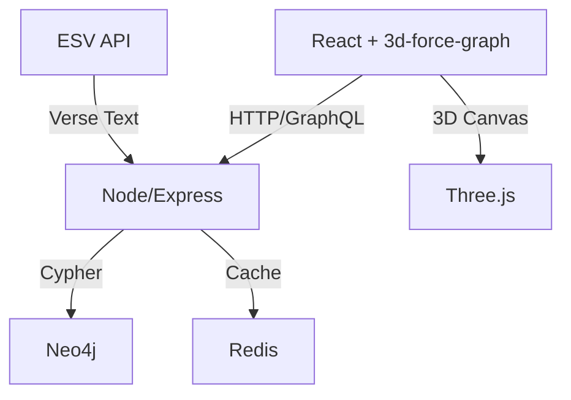

# 📖 Interactive Bible App

[](https://www.docker.com/)
[](https://nodejs.org/)
[](https://neo4j.com/)
[](#license)

## Overview
Interactive visualization of Bible cross-references using ESV, Neo4j graph, React/Three.js. Adheres to Creationism, no evolution references.

### ✨ Highlights
- 3D force‑directed graph of cross‑references (31k+ verses, 100k+ edges)
- Live verse text from ESV API (no text stored; license‑compliant)
- Fast graph queries with Neo4j and pre‑seeded DB for zero‑ingestion setup
- Filter by book/type; connections, hubs, and more (extensible)

### Prerequisites for the Interactive Bible App

To run the app locally, ensure you have the following software and configurations. These are standard for a Node.js/React app with Dockerized services (Neo4j database, Redis caching). The setup assumes a development environment on macOS, Windows, or Linux.

#### Software and Tools Required
- **Node.js and npm**: Version 18 or higher (LTS recommended).  
  - Download from: [https://nodejs.org/](https://nodejs.org/)  
  - Why: Handles JavaScript runtime and package installation (e.g., `npm install`).

- **Docker**: Docker Desktop (includes Docker Compose v2).  
  - Download from: [https://www.docker.com/products/docker-desktop/](https://www.docker.com/products/docker-desktop/)  
  - Why: Simplifies running the database and cache without manual installation. Ensure Docker is running before using `docker-compose up`.

- **Git**: For cloning the repository.  
  - Download from: [https://git-scm.com/](https://git-scm.com/)  
  - Why: To get the code: `git clone https://github.com/jdc316/interactive-bible-app`.

- **ESV API Key**: Required for fetching Bible text dynamically (from Crossway ESV API).  
  - How to obtain: Sign up for a free account at [https://api.esv.org/account/create-application/](https://api.esv.org/account/create-application/). Fill out the form with your app details (name, description, mark as non-commercial). It's free for non-commercial use, with fair-use limits (e.g., no bulk storage beyond 500 verses; dynamic fetching only). Approval is quick, and you'll get a token key via email or on the dashboard.  
  - Why: Complies with copyright; without it, text fetching will fail.

- **Optional: Redis**: If not using Docker (which includes it), install locally for caching.  
  - Why: Improves performance for repeated queries (e.g., verse text).

No other prerequisites like Python or additional libraries are needed, as everything runs in Node/Docker.

### 🚀 Quick Start (Pre‑seeded DB)
1. Clone the repo and enter the folder:
   ```
   git clone https://github.com/jdc316/interactive-bible-app
   cd interactive-bible-app
   ```
2. Choose ONE dump source:
   - Remote (recommended): set an environment variable pointing to your Release asset URL
     ```powershell
     $env:NEO4J_DUMP_URL='https://github.com/<owner>/<repo>/releases/download/<tag>/neo4j.dump'
     ```
   - Local fallback: place a file named `neo4j.dump` inside the repo’s `neo4j/` folder
3. Start services (first run auto‑restores the DB):
   ```
   docker compose build neo4j
   docker compose up -d
   ```
4. Open the app:
   - Frontend: http://localhost:3000
   - Backend: http://localhost:3001
   - Neo4j Browser: http://localhost:7474 (login neo4j/password)

---

#### Local Environment Setup Steps
1. **Clone the Repo**:  
   ```
   git clone https://github.com/jdc316/interactive-bible-app
   cd interactive-bible-app
   ```

2. **Install Dependencies (host, optional)**:  
   - Backend (only if running outside Docker): `cd backend && npm install`  
   - Frontend (only if running outside Docker): `cd ../frontend && npm install`

3. **Configure environment**  
   - Docker Compose sets Neo4j/Redis creds automatically. For local Node scripts, set these environment variables (PowerShell example):  
     ` $env:NEO4J_URI='bolt://localhost:7687'; $env:NEO4J_USER='neo4j'; $env:NEO4J_PASSWORD='password'; $env:REDIS_URL='redis://localhost:6379' `  
   - ESV API Key (required for verse text): obtain from `https://api.esv.org/account/create-application/` and set `ESV_API_KEY` (Compose passes through if defined).
   - Optional `.env` in `backend/` (if you prefer a file):  
     ```
     NEO4J_URI=bolt://localhost:7687
     NEO4J_USER=neo4j
     NEO4J_PASSWORD=password  # Default; change if customized in Docker
     ESV_API_KEY=your_token_here  # From ESV signup
     REDIS_URL=redis://localhost:6379
     JWT_SECRET=some_secure_secret  # For future auth; can be random for now
     ```

4. **Start Services with Docker**:  
   - Run `docker compose up -d` (detached mode).  
   - This starts Neo4j (browser at http://localhost:7474), Redis, backend and frontend.  
   - First run behavior: If there is no DB data in `./neo4j/data`, the Neo4j container auto-restores from a dump.  
     - Remote dump: set `NEO4J_DUMP_URL` in your environment before `docker compose up -d`.  
     - Local dump: place `neo4j.dump` in the repo’s `neo4j/` folder; the container uses it if `NEO4J_DUMP_URL` is unset.  
   - Verify: In the Neo4j browser, login with neo4j/password.

5. **Initialize Database Schema**:  
   - `cd backend && node db/init.js`  
   - This loads `backend/db/schema.cypher`, handling comments/quotes; creates constraints/indexes and a default `Translation` node.

6. **Ingest Data**:  
   - `node scripts/parseBibleStructure.js` (generates `backend/bible_structure.json`)  
   - `node scripts/parseCrossRefs.js` (normalizes TSV → `raw_cross_refs.json`)  
   - `node scripts/validateCrossRefs.js` (writes `validated_cross_refs.json`; logs invalids to `validation_errors.log`)  
   - `node scripts/ingestData.js` (idempotent MERGE-based ingest; creates `Book/Chapter/Verse` with relationships and cross-references)  
   - Optional: `node scripts/analysis.js` if you have Neo4j GDS enabled (writes `v.centrality_score`).

7. **Start Servers**:  
   - Prefer Docker: backend and frontend are already running via Compose on http://localhost:3001 and http://localhost:3000.  
   - Or host-run (for development only):  
     - Backend: `cd backend && npm start`  
     - Frontend: `cd frontend && npm start`

8. **Test**:  
   - Visit http://localhost:3000 – should show a Genesis subgraph.  
   - API tests (note: reference normalization accepts `Gen.1.1` and `Genesis.1.1`):  
     - `http://localhost:3001/api/v1/verses?reference=Gen.1.1`  
     - `http://localhost:3001/api/v1/connections?reference=Gen.1.1&depth=2`  
     - `http://localhost:3001/api/v1/subgraphs?filters={"book":"Genesis"}`

#### Troubleshooting
- **Docker errors**: Ensure ports 7474/7687/6379/3000/3001 are free and Docker has sufficient resources. Close host `npm start` processes if ports are in use.
- **First-run restore**: If the DB didn’t restore, ensure `NEO4J_DUMP_URL` is reachable or `neo4j/neo4j.dump` exists. Then `docker compose down -v && docker compose up -d`.
- **ESV fetch fails**: Verify API key validity and network connection.
- **Ingestion slow**: For full data, it processes in batches; expect 5–15 minutes on first run.
- **Other issues**: Check console logs; ensure all deps installed without errors.

This setup ensures the app's steps (e.g., ingestion, APIs, graph rendering) work as implemented. If expanding features (e.g., auth), add more .env variables as needed.

## Setup Local Environment
1. Clone repo: `git clone https://github.com/jdc316/interactive-bible-app`
2. Install deps: `cd backend; npm install` and `cd ../frontend; npm install`
3. Set .env in backend: NEO4J_URI, NEO4J_USER, NEO4J_PASSWORD, ESV_API_KEY (get from https://api.esv.org/account/), REDIS_URL (optional)
4. Run Docker: `docker-compose up` (starts Neo4j, backend:3001, frontend:3000)
5. Ingest data: `cd backend; node scripts/ingestData.js` (downloads cross-refs if needed)
6. Access: http://localhost:3000
7. Tests: `npm test` in backend/frontend

## 🏗️ Architecture


## Deployment
- Cloud: AWS (EC2 for backend, S3 for frontend, Aura for Neo4j)
- CI/CD: GitHub Actions for build/test/deploy
- Monitoring: Prometheus/Sentry

## Recommended Tools/Extensions
- VS Code extensions: 
  - Docker (manage containers), 
  - ESLint (consistent JS formatting), 
  - EditorConfig, 
  - Prettier (optional), 
  - GraphQL (syntax support), 
  - Neo4j VS Code extension (optional) or Neo4j Browser at `http://localhost:7474`.
- Neo4j Desktop or Neo4j Browser for inspecting data and running Cypher queries.
- Postman/Bruno/HTTPie for API testing.

## License
Non-commercial; ESV license compliance enforced.
